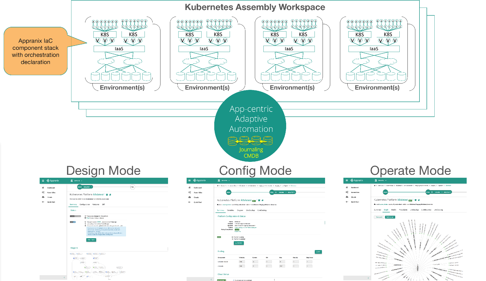

# How does Appranix SRA work?
Appranix Site Reliability Automation (SRA) platform is inspired by Amazon Web Services OpsWorks and CloudFormation Services. Similar to OpsWorks, Appranix SRA creates and manages stacks, and allows cloud operations teams to use Infrastructure-as-Code (IaC) and Configuration Management frameworks as building blocks for deployment and operations. But unlike, CloudFormation and OpsWorks AWS cloud-specific services, Appranix avoids cloud lock-in with a flexible yet powerful multi-cloud Kubernetes cluster management system by extending Chef and Ansible with a simplified YAML declarative model. Appranix YAML also has the flexibility to embed cloud infrastructure and operating system monitoring and logging declarations. These simple and yet familiar opensource operations frameworks allow cloud operations teams to be comfortable with Appranix quickly.

  Appranix also uses Google Cloud Platform’s Project(s) concept to define workspaces called ***Assemblies*** to help manage a large number of enterprise clusters for different DevOps teams. Assemblies have three different ***Modes*** called ***Design***, ***Configure and Operate*** to help track the Kubernetes system lifecycle with distinctive releases and deployments using a ***Timeline*** capability. Timeline feature allows cluster operations SRE teams to rollback and roll-forward the entire Kubernetes infrastructure and configuration to any point in time.

  Underlying all these capabilities is the Appranix’s infinitely scalable ***Journaling Configuration Management Database (JCMDB)*** which keeps track of all the configuration changes from multiple clusters on multi-cloud platforms.

  Various Kubernetes designs can be created and stored as ***Catalogs*** for teams to use across the enterprise. For example, a K8s design has multi-node and multi-master that works only on AWS. Another design could be declared and stored for VMware and so on.

   Once designs are cataloged, they can be configured and deployed in an ***Environment***. There can be multiple environments. An environment can be run and operated on AWS whereas another ***Environment*** can be operated on VMware for the same design.

  At the center of the system is an ***Adaptive Automation*** capability that takes all the information defined by the SRE teams for various Kubernetes designs, and runs them on any cloud depending on the configuration. The end result is a system to consistently achieve high SLOs (Service Level Objectives) to deliver, protect and optimize Kubernetes development, QA, production and DR environments for enterprise DevOps teams.

  There is also a cloud resource consumption reporting service that keeps track of all the cloud resources spent over a period of time and associates the actual consumption with cloud resource costs.

  <figure class="concept_image">
    
  </figure>
