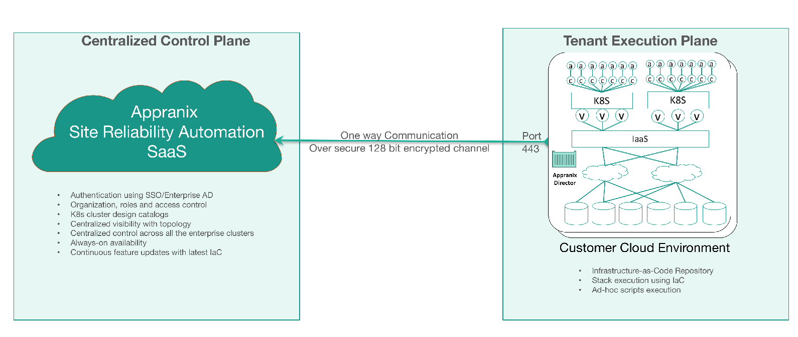

#Appranix SRA is Delivered as-a-Service

There are two components to the Appranix platform. A centralized control plane that controls all the centralized functions such as authentication, centralized catalogs, declaring and managing Assemblies for many enterprise clusters with a centralized visibility across the enterprise running on many data centers and multi-cloud platforms. Second component is the execution plane that runs inside the datacenter or customer cloud VPC which actually performs actions based on the decisions made by the users of the control plane. Execution plane has a component called “Director” that performs the actions specified by the control plane. All the communications are 128-bit encrypted over a secure https channel.

<figure class="concept_image">
  
</figure>
