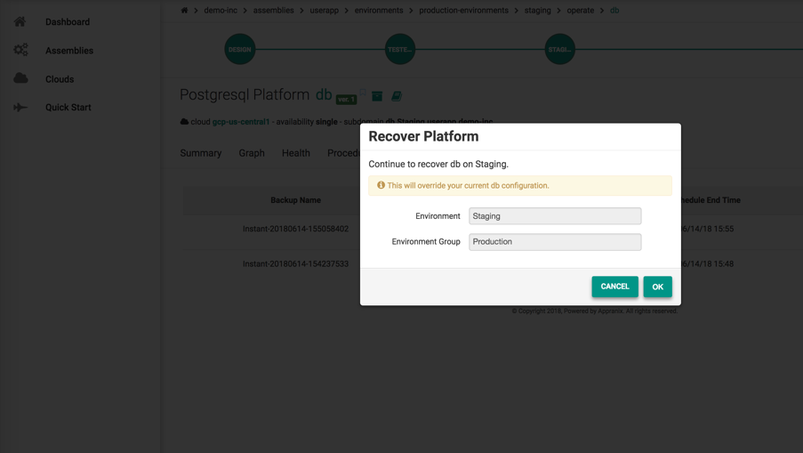
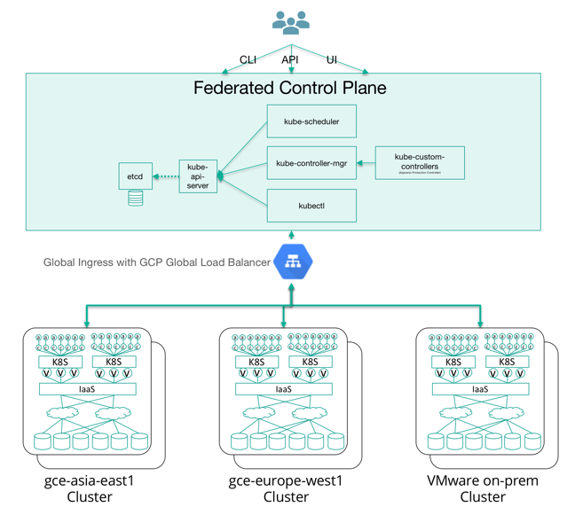

# Managing Enterprise Container Clouds using the Appranix SRA Platform
###1. Designing Highly Available (HA) Kubernetes Clusters
Designing highly available K8s clusters using Appranix is much easier by leveraging templates available in the Appranix Deliver Service. Appranix provides templates for private VMware environments or public cloud platforms like AWS, Azure or Google Cloud Platform. If an enterprise or a service provider wants to build multiple clusters across different applications or DevOps groups, it is recommended to leverage the templates to quickly build systems across different environments such as Production or Disaster Recovery or Staging. Even system administrators who are not familiar with K8s can deploy using Appranix Deliver Service (ADS) on any cloud.

  To start with, create an Assembly workspace, and specify Cloud IaaS endpoints. Within the Assembly workspace, a cluster Environment can be created to provision all the necessary cloud or VMware infrastructure.

  K8s designs can be iterated over a period of time. For example, adding different load balancers or adding new binaries for components such as Docker, or changing VM instances sizes are easier using versioned Timeline feature. One can also go back in time to recover the old designs easily using ADS.

  <figure class="concept_image">
    
  </figure>

###2. Continuous Delivery of Highly Available Kubernetes Clusters
A Site Reliability Engineer (SRE) can achieve continuous delivery of K8s infrastructure with the advanced automation capabilities built into the Appranix Deliver Service. SREs can deploy K8s components across many different cloud regions/environments simultaneously. Every time an update or change happens within the Assembly workspace, all the changes will be simultaneously propagated to all the environments that were originally deployed. ADS has an advanced multi-step, dependency-based orchestration system. These dependencies are declared ahead of time using K8s Infrastructure-as-Code (IaC). K8s IaC is built using Chef or Ansible depending on the preference of the organization. K8s IaC versioning for continuous delivery can be done using any code repository system such as Github or Bitbucket.  

<figure class="concept_image">
  
</figure>

###3. End to end Visualization from Containers to MultiCloud Infrastructure
It is very important for SREs to visualize how K8s clusters are being used by the developers or other business groups.   Without getting an end to end view from containers to PoDs to Nodes to cloud infrastructure, it is impossible to deliver the Service Level Objectives promised to them. Appranix SRA platform provides per cluster level Visualizer with Containers to PoDs to Nodes with all the details gathered within the network. Cluster operators and SREs can then drill down from the Nodes to virtual machine hosts on a particular cloud with a link from the Visualizer for various use cases. This split approach allows to share the view with the cluster users as well as operators, so the groups can work together to resolve availability, performance, capacity and compliance issues for a particular cluster or a range of clusters across the enterprise container cloud.

<figure class="concept_image">
  
</figure>
<figure class="concept_image">
  
</figure>

###4. Rollback or Roll-forward Clusters to Points-in-Time with Protect Service

Appranix Protect Service allows SREs to safely go back and forth to a particular point-in-time release or deployment of the cluster infrastructure. Releases are configuration changes to existing deployments or minor changes. Deployments are cluster design changes or software upgrades. Appranix will warn the users of the configuration changes before applying a rollback to avoid any production cluster issues. This capability is enabled by the built-in ***Journaling Configuration Management Database (JCMDB).***

<figure class="concept_image">
  
</figure>

###5. Managing Kubernetes Clusters for Performance and High Availability

Kubernetes is a well-designed system for managing the scale of applications based on the container specifications (Kube specs) from developers. However, the underlying cloud infrastructure for Kubernetes should be managed properly to achieve the performance and availability required. Appranix not only gives a global view of all the clusters in one centralized service but allows SREs to identify a particular cluster across the entire container cloud and locate troublesome PoD and the underlying cloud infrastructure virtual machine hosting the K8s node. This level of detail is automatically surfaced with a simple color-coded graph. A green indicates the infrastructure is functioning properly, a yellow indicates that the operator has to take a look at the problem, and a red indicates that the infrastructure is either down or completely destroyed which means it has be recovered either from back up or recreated.

<figure class="concept_image">
  
</figure>

####5.1. Monitoring PoDs and Nodes

Kubernetes PoDs within a particular cluster can be monitored using Appranix Platform’s built-in infrastructure monitoring or integrated with third-party monitoring systems. When a PoD performance degrades due to the underlying Node problem, Appranix can immediately notify the cluster administrator with built-in Notifications system so a Node performance or availability issue could be addressed immediately. Centralized historical performance charts can be used to plan and optimize the cluster Nodes infrastructure appropriately.

<figure class="concept_image">
  
</figure>
<figure class="concept_image">
  
</figure>

####5.2. Load Balancing Kubernetes Cloud Infrastructure

When Kubernetes needs to scale for availability or for performance based on the load from the application containers, either the master or minion nodes or both need to scale. Appranix SRA platform’s load balancer automation steps-in based on the configurations to reconfigure and reroute the load. SREs can get Notifications based on the availability. They can also take in-context changes using built-in Chef or Ansible based automation without affecting production containers workloads running on K8s.

<figure class="concept_image">
  
</figure>

###6. Optimizing Kubernetes for Availability with Dynamic Scaling

K8s clusters can be dynamically scaled either manually or using the built-in automated LiveScale feature. Both master and minion nodes can be scaled based on organization-specific policies. When the scaling policies are applied, as mentioned above, Appranix SRA automatically reconfigures the load balancers as well. Initially, cluster operators can start with a set of pre-configured policy values such as the minimum number of master and minion nodes, and a number of node to scale at a time based on the load. Based on the historical data it is then recommended to optimize based on the load over a period of time. For instance, a production cluster with a few cluster Namespaces running can have a policy that should have at least two masters and minions can only be increased or decreased one at a time. LiveScale can apply the step-up or step-down policy of one node at a time. AOS can also auto-detect K8s control plane failures in master nodes so it can auto repair and recover without SREs intervening the system. LiveRepair and LiveReplace features can auto-detect minion nodes component failures and repair or replace them automatically.

<figure class="concept_image">
  
</figure>
<figure class="concept_image">
  
</figure>

###7. Container Clouds Capacity Planning and Optimization with AOS (Appranix Optimize Service)

Kubernetes system frees application developers from requesting infrastructure resources from IT and lengthy service ticketing process. Since it encourages self-service with declarative infrastructure consumption based on the application needs, the cloud infrastructure running the K8s needs to be preplanned, so the compute, storage and network pools are appropriately provisioned and ready for faster continuous application delivery cycles. Depending on the organization and applications type and scale, creating, running and maintaining large container clouds are cumbersome and very expensive. If capacity planning is not part of managing large container clouds, it could get out of hand very easily and it would make fixing the backend infrastructure very hard. Appranix Optimize Service offering gives cloud infrastructure capacity reports along with notifications segregated by different clusters across organizations. SRE and cluster operations teams can combine capacity information along with cost data to decide how to optimize the cloud infrastructure. If Appranix SRA is being used to manage clusters on VMware private clouds hosted on organization’s datacenter, getting capacity reports on-time to help plan for the lead times associated with procuring and installing hardware.
<figure class="concept_image">
  
</figure>
<figure class="concept_image">
  
</figure>

###8. Optimizing Container Clouds for Cost

If managing a large set of Kubernetes clusters as container clouds for the entire organization is hard enough, then optimizing cluster infrastructure capacity for cost is another painful undertaking. However, with appropriate analytics, notifications, change management capabilities, it is possible to optimize individual or many cluster environments to save the cost for organizations. Cost optimization is particularly important when organizations use public clouds to host some of the clusters. Given Kubernetes’ flexibility to shift container workloads across different clusters, it is possible to move some workloads to a cluster running in lower-cost region of the public cloud or even bring back the workload to privately hosted clusters within the datacenter. Appranix Optimize Service offering gives a lot of reports and analytics to help control the cost. Using the same built-in automation capabilities of the platform, organizations can identify cost over-runs with historical data points and make on-the-fly modifications using the same continuous delivery capabilities.
<figure class="concept_image">
  
</figure>
<figure class="concept_image">
  
</figure>

###9. Managing Configuration Consistency across Container Cloud Infrastructure

If deploying and managing a single large cluster is hard enough for operations teams, it only gets much harder for them to manage multiple clusters across different data centers and across private and public clouds infrastructures. Maintaining configuration consistency across various clusters is sometimes impossible. Appranix Deliver Service (ADS) makes it easier to achieve the consistency using LiveCompare feature that compares configurations between two different clusters live infrastructure with one click.  It is even possible to compare two cluster configurations across two very different cloud infrastructure platforms. This is possible due to Appranix SRA platform’s unique built-in Journaling Configuration Management Database (jCMDB).

<figure class="concept_image">
  
</figure>

###10. Protecting Clusters against Cloud Zone or Region Failures with APS (Appranix Protect Service)

Cluster administrators can protect their production clusters against cloud IaaS region or zone failures with APS. Leveraging Appranix SRA platform’s infinitely scalable JCMDB, Timeline capabilities combined with K8s master and minion redundant deployment capabilities, one can shift all the end user container loads to another APS recovered cluster in another region with minimum disruptions. One needs to design the clusters upfront with region failure recoveries in mind using global load balancer configurations. All the PoD configurations and underlying Node configurations will be automatically handled by APS. Furthermore, if organizations leverage Appranix’s application deployment capabilities, all the containers will be auto-deployed to the recovered clusters as well.

###11. Managing Security Certificates with APS 
Managing certificates for large enterprise containers clouds is very time-consuming and error-prone beside being a security nightmare. Kubernetes strictly enforces operation flows with kubelets and other external interaction points can only communicate through the API server. Custom controllers such as Appranix Protection Controller can only communicate through kube-controller-managers. In a redundant cluster configuration design, where there are redundant master nodes with redundant etcds and api-servers, for a 100-node cluster, SREs need to manage at least 300 certificates. This includes creating and vaulting the certificates, rotating them frequently. Appranix platform makes sure that each component of the K8s cluster gets a unique certificate and the entire process is completely automated. SREs and cluster operators get all the logs of what happened in the system for auditing purposes.  

Appranix Protect Service (APS) offering has a built-in Hashcorp Vault configured as part of the “Director” execution plane within the customers’ data center.  All the keys are customer controlled and never leave the customer premises.

<figure class="concept_image">
  
</figure>

###12. Protecting and Recovering Clusters with APS

A major part of on-going Site Reliability operations involves creating, maintaining backups of cluster environments for recovery of the clusters due to disasters. It is particularly important to back up the masters and specific configuration files such as api-server configurations, all the cloud platform configurations, controller configurations etc. It is easy to configure backup policies with APS. SREs can automate backups with hourly, weekly, monthly and even yearly policies with specific retentions based on the organization requirements. APS makes use of cloud providers’ storage snapshots to backup masters and minions fast and maintain consistency with etcd key-value store configurations.

Backing up minion nodes depends on the type applications run. Most of configurations are protected when containers are automatically shifted to other nodes when a node failure occurs. However, applications and services such as databases that use stateful sets, persistent volume sets will most likely need to be backed up for recovery.

<figure class="concept_image">
  
</figure>
<figure class="concept_image">
  
</figure>

####12.1. Running Highly Available etcd
Kubernetes etcd is the most important system to protect with high availability along with backup and recovery capabilities. etcd is designed to withstand node failures with the right master node configurations. An etcd cluster is capable of recovering automatically from temporary failures and can tolerate up to (N-1)/2 permanent failures for a cluster of N member nodes. When a member node permanently fails, whether due to hardware failure or disk corruption, it loses access to the cluster. If the cluster permanently loses more than (N-1)/2 members then it disastrously fails, irrevocably losing quorum. Once quorum is lost, the cluster cannot reach consensus and therefore cannot continue accepting updates.
Assuming ADS deployed a highly available multi-node etcd cluster design, SREs can leverage LiveScale, LiveRepair and LiveReplace automated features to fix etcd nodes upon any failure based on monitoring thresholds. Using LiveBackup and LiveRecovery capabilities of APS, cluster operators can backup and recover etcd state based on their organization policies. One of the key differentiators of APS compared to the legacy backup systems is that it is app-centric which allows SREs to recover other K8s master component configurations in-sync with a particular point-in-time etcd backup.

<figure class="concept_image">
  
</figure>

###13. Kubernetes Federation with APS

Appranix encourages organizations to setup federated K8s when public cloud IaaS providers are used for production clusters. This highly available configuration allows SREs to recover from region failures of the providers. K8s federation capabilities can also spawn across two different cloud providers, including hybrid-cloud configuration where an organization can run clusters on a private VMware cloud in a data center and public cloud IaaS. To leverage all the capabilities of kubefed, K8s federation is best configured with a Global Load Balancer like Google Cloud’s global load balancer. Assuming that organizations have configured a global load balancer, Appranix SRA platform can take care of the on-going every day operations of such a complex multi-master federated system. For example, ADS will automatically propagate all the updates and changes to all the clusters across the federated system to keep all the configurations consistent.

###14. Patching and Upgrading Kubernetes Nodes

Site Reliability Engineers and clusters operators can upgrade the host node operating systems and other components of the K8s system easily with a few clicks using the built-in Infrastructure-as-Code. They can also very easily customize the operational playbooks and version them as they continue to maintain all their clusters on a daily basis. AOS can automate most of the security patch updates across all the nodes with a few clicks.

<figure class="concept_image">
  

</figure>

###15. Setting Service Level Indicators (SLI) and Managing Service Level Objectives (SLOs)
SLI is a carefully defined quantitative measure of the level of service* provided by the SREs. For example, SREs could say cluster availability will be 99.9% (three-nines). Service Level Objectives are goals set by the organizations to achieve the SLI targets or range of targets usually defined as SLI <= target. Defining such SLIs for clusters availability and other important measures, and achieving the targets is very hard for SREs unless there is a solid Site Reliability Automation system to help them deliver, protect and optimize the container clouds continuously. Appranix SRA is a platform to help organizations to achieve such SLO targets and help them continuous adjust their SLIs based on the organization needs and automation capabilities. In fact, Appranix SRA platform utilizes Appranix Services to achieve our 99.9% availability targets.

###Summary

Deploying and managing multiple large, highly available, protected and optimized Kubernetes clusters to run enterprise or service provider container clouds are very hard and expensive. Appranix SRA radically simplifies the effort and cost of not only deploying the clusters but managing them effectively with its enterprise scale secure platform.  
