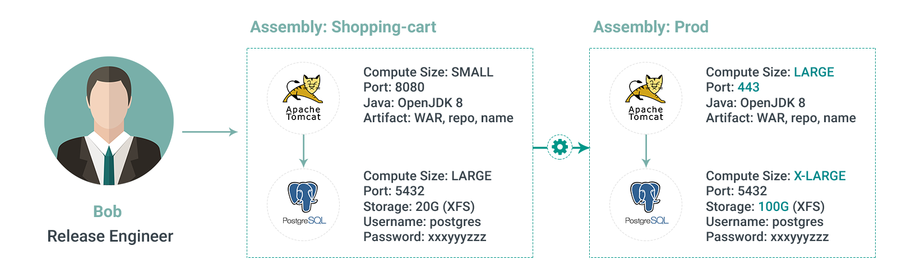

# Introduction

This page explains the underlying concepts of the Appranix. It gives a clear picture about each element and why it is needed.

- [Account](#account)
- [Organization](#organization)
- [Assembly](#assembly)
- [Clouds](#clouds)
- [Environment](#environment)
- [Environment Group](#environment-group)
- [Assembly Modes](#assembly-modes)
  - [Design](#design)
    - [Platforms](#platforms)
    - [Components](#components)
  - [Configuration](#configuration)
  - [Operation](#operation)

# Account

An Appranix account is the topmost entity, created when a company or a person signs-up for Appranix service.
Appranix account can contain multiple organizations. The users are unique for
an account and are granted access to various organizations within the account.

<figure class="concept_image">
  
</figure>

# Organization

An Organization is the top level entity within which all related operations are performed.
The term organization is used to logically group all your resources. Any resource in an organization cannot be accessed by other organizations, so all the resources are protected within the organization. If you work for a small company, you may very well group all your resources under one organization. If, however, you work for a big company, you may have decided to have an organization per department, so you can manage the allocation of team, resources, clouds and services better.
This decision is entirely up to you, and it should be planned carefully.

# Assembly

Assembly is an application specification with all platforms and its connectivity with configurations,
it is the assembly of various platforms and components to form a business application.

Assembly is similar to a production assembly where we assemble various parts together to for a product.
Here we assemble various platforms together in a specific order to form an application.

Assembly not just manages the design specification, but also manages the running instances of the application.
Assembly goes through various modes, design, configuration and operation,
it contains the design and realized instances of them through various stages and helps them to maintain
 throughout their life cycle.

<figure class="concept_image">

</figure>

For more on Assembly, see [Assembly tour](./tour/3.5-assembly.md)

# Clouds

Cloud is a collection of services, provided by various vendors, specific to a region or global.
Cloud helps to realize your application design in a provider's data center.
You cannot deploy any application if you don’t have a cloud.

Any cloud should be specific to a geographical location (cloud region) as it helps to identify
where the real servers and the services are consumed or used and served to customers.

A cloud consist of various services, like Compute, Object storage, DNS, etc.,
these services are expected to be in close proximity even when they are from different providers.

You can have a cloud with "Compute" from Azure (VM) and "Object storage" from AWS (S3).
Cloud helps to run your application in multiple regions if you choose to deploy in multiple clouds.
It helps to run your production with high availability across multiple regions and providers.

For more details, refer [Clouds tour](./tour/3.4-cloud.md)

# Environment

An Environment is the realized assembly design, on one or more clouds. Environment have configuration changes as required before deployment, which may change from the original design. These changes may be different from other Environments, making them unique.

For more details, refer [Environment tour](./tour/3.6-environment.md)

# Environment Group

An Environment Group is a staging group, where we prefer to group multiple environments of the same type. Eg: Dev Environment group, will consist of multiple instances/Environments of the application used for development.

<figure class="concept_image">

</figure>

Here, ERP and CRM are the Assemblies. dev-aws-east-01, prod-aws-west-01, prod-aws-west-02 are the clouds in which the Assemblies are deployed. In ERP Assembly, dev-01 and int-01 are the Environments that belong to an Environment Group. qa-01 and uat are the Environments deployed on different clouds but belongs to same Environment Group. The Environments named prod and pre-prod are deployed in multiple clouds in redundant mode.

To create an Environment Group, see [Create Environment Group](./configurations/4.1.3-create-environment-group.md)

# Assembly Modes

An assembly switches between various modes during daily operation.
The modes are Design, Configuration and Operation. Each mode helps to do a
 specific operation on the assembly or on an Environment.

# Design

The design is the mode in which the architecture of the application has been defined. It allows us to specify the platforms and the components that are necessary for the application.

#### Contextual Example

>##### [Steve](./references.md), the architect, designs the assembly. 
* Acme Inc, Fashion store has their online shopping-cart.
* Steve, the architect, designs an assembly representing their shopping-cart.
* The application has a Java web app, WAR deployed on tomcat and uses PostgreSQL as its backend database.
* The application will run as cluster in production and will run as single instance during development.  

> 

In design mode, we assemble the Platforms required for the Assembly.
The dependency between the Platforms are explained here like webapp depends on db.
You can customize more on the Platform by configuring the Components of the specific Platform.
The design mode helps to edit the default values of each component, add more components to a platform,
make it more meaningful to meet your application.

In the above contextual example, we have a WAR file to be deployed on Tomcat.
This can be achieved by adding artifact component to Tomcat and adding config files,
with parameterized variables. This creates a template of the application spec,
which can be deployed as various Environments when needed.

For more information, read about Platform and Component in the following section.

### Platforms

Platforms are pre-built software with easy to configure and operate options. They are building blocks to form a business application that is interconnected with multiple platforms. Some examples of Platforms: Cassandra, JBoss, PostgreSQL, Kubernetes etc.,

<figure class="concept_image">

<!--  <figcaption>Figure 1: Platforms</figcaption> -->
</figure>

### Components

Components are building blocks of a platform, which can be configured to ensure
the platforms are deployed in our required specification. The components may
depend on other components to function, they can be individually monitored,
repaired and replaced. Each component has a specific configuration and pre-defined
actions, the actions are useful to perform operation tasks on a specific instance
in an Environment. Eg: Reboot action on OS component, Reload action on a daemon component.

A platform is built on top of ordered and configured components, example of a Cassandra platform is shown

<figure class="concept_image">

</figure>

# Configuration

Configure is the mode in which the application design is configured for specific Environment with custom values and it is deployed on the specified cloud based on the design. This will create a new Environment to run the application. Various environments can be created from a single design. The workorder of the deployment is based on the design of the application.

#### Contextual Example

>##### [Bob](./references.md), the release engineer, configures and deploys. 
* Bob, the release engineer, needs to release the application to production.
* Creates a new Environment, chooses the cloud for the deployment and ensures it runs in a redundant mode for HA.
* Bob, takes care of configuration changes specific for production as explained above in configure mode.
* Once Bob is comfortable with the configuration he commits and deploys it.
* The deployment brings the Environment to reality by creating VMs on the cloud. Which is ready for operations.  

>

# Operation

Operate is the mode in which the created Environment is monitored. Operate mode helps to take action on the running instances/components in a specific Environment. This could be a repair, replace or similar action on one or more components.

#### Contextual Example

>##### [Bill](./references.md), the ops. engg./SRE, ensures availability. 
* Bill, the operations engineer, is responsible for the availability of the production shopping cart.
* Bill, monitors the instances, ensures he gets alerts on failures through the Operations mode for a specific Environment
* Bill, identifies the instances that could cause the problem through his alerts from Appranix and proceeds to fix them via various options(restart, repair, replace, scale.. Etc.,) in the portal or logs into a specific node to take action by his custom method.  

>
