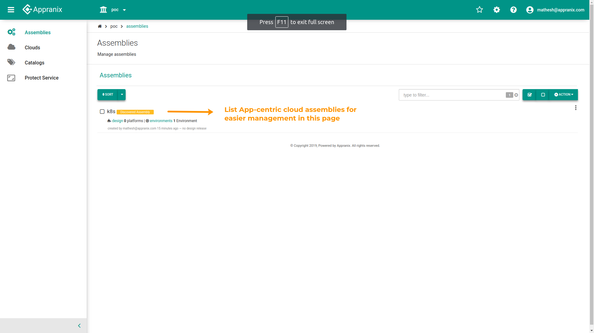

##Appranix Protect Service 

Appranix Protect Service offers protection and cross-region recovery of applications at a massive scale using cloud-native, app-centric data management. SREs and cloud operations teams do not have to use any complicated scripts or infrastructure-centric backup tools on top of cloud virtual machines. Appranix discovers hundreds and thousands of data points from cloud resources to automate the cross-region recovery for disaster recovery, test and development, ransomware recovery and business continuity.

<figure class="concept_image">
  
<p style="text-align: center;"> Figure 1 - Cloud accounts </p>
</figure>

<figure class="concept_image">
  
<p style="text-align: center;"> Figure 2 - Configure your public cloud</p>
</figure>

<figure class="concept_image">
  
<p style="text-align: center;"> Figure 3 - Discovered cloud resources</p>
</figure>

<figure class="concept_image">
  
<p style="text-align: center;"> Figure 4 - Create Assembly</p>
</figure>

<figure class="concept_image">
  
<p style="text-align: center;"> Figure 5 - Assemblies list</p>
</figure>


<figure class="concept_image">
  
<p style="text-align: center;"> Figure 6 - Discovered cloud resource details</p>
</figure>


<figure class="concept_image">
  
<p style="text-align: center;"> Figure 7 - Protection policy creation </p>
</figure>

<figure class="concept_image">
  
<p style="text-align: center;"> Figure 8 - Protection timeline</p>
</figure>

<figure class="concept_image">
  
<p style="text-align: center;"> Figure 9 - Recover</p>
</figure>


<figure class="concept_image">
  
  <p style="text-align: center;"> Figure 10 - Reset</p>
</figure>

##Process to Delete Environments and Assemblies

1.Select the required Cloud name from the Cloud Account Page
  <figure class="concept_image">
    
    <p style="text-align: center;"> Figure 1 - Cloud accounts</p>
  </figure>

2.Click the associated  Assembly to view the environments list
  <figure class="concept_image">
    
    <p style="text-align: center;"> Figure 2 - Resource List</p>
  </figure>

3.In Assembly Page, select the environment from the environments list
  <figure class="concept_image">
    
    <p style="text-align: center;"> Figure 3 - Environment List</p>
  </figure>

4.In Environment Configuration Tab, Click the “DELETE” button for Deleting the environment
  <figure class="concept_image">
    
    <p style="text-align: center;"> Figure 4 - Environment Configuration</p>
  </figure>

5.Select the required option for deleting the snapshots at primary and recovery regions. Type text ‘DELETE’’ to confirm
  <figure class="concept_image">
    
    <p style="text-align: center;"> Figure 5 - Delete Confirmation</p>
  </figure>

6.Once the delete action is triggered by APS,  all the selected resources will be deleted in the order in which they were created. It may take a few minutes to complete. APS will redirect the user to the Cloud Configuration Page.
  <figure class="concept_image">
    
    <p style="text-align: center;"> Figure 6 - Cloud accounts</p>
  </figure>

## DNS Configuration

1.Enable/Disable DNS Configuration
  <figure class="concept_image">
    
    <p style="text-align: center;"> Figure 1 - DNS Configuration</p>
  </figure>

2.Enabling IAM policy for the zone
  <figure class="concept_image">
    
    <p style="text-align: center;"> Figure 2 - Enable IAM policy</p>
  </figure>

3.Adding zone record set
  <figure class="concept_image">
    
    <p style="text-align: center;"> Figure 3 - Add zone</p>
  </figure>

4.Record set details
  <figure class="concept_image">
    
    <p style="text-align: center;"> Figure 4 - Record</p>
  </figure>

5.Update DNS record set
  <figure class="concept_image">
    
    <p style="text-align: center;"> Figure 5 - Update DNS</p>
  </figure>

6.Reset DNS record set
  <figure class="concept_image">
    
    <p style="text-align: center;"> Figure 6 - Reset DNS</p>
  </figure>  

##Storage Encryption Mapping for Recovery

1.Enable/Disable Storage encryption by Default Key
 <figure class="concept_image">
    
    <p style="text-align: center;"> Figure 1 - Default key</p>
  </figure>
2.Sync Custom Keys Storage encryption
<figure class="concept_image">
  
  <p style="text-align: center;"> Figure 2 - Sync Custom keys</p>
</figure>
3.Map corresponding Recovery Region KMS key to the Primary Region key
 <figure class="concept_image">
    
    <p style="text-align: center;"> Figure 3 - Mapping</p>
  </figure>

####Appranix requires the following prerequisites to protect the AWS resources

  * AWS API Key
  
  * AWS Secret Key

  * Apply the IAM policy shown below in the AWS primary and recovery regions


   IAM policy JSON details for the Primary Region:
```Json
{
	"Version": "2012-10-17",
	"Statement": [{
			"Sid": "AppranixPrimaryRegionEc2AndElbReadAndSnapshotWriteAccess",
			"Effect": "Allow",
			"Action": [
				"ec2:Describe*",
				"ec2:CreateSnapshot",
				"ec2:CreateTags",
				"ec2:CopySnapshot",
				"ec2:DeleteSnapshot",
				"ec2:DeleteTags",
				"elasticloadbalancing:Describe*"
			],
			"Resource": "*",
			"Condition": {
				"StringEquals": {
					"aws:RequestedRegion": "Replace your primary region"
				}
			}
		},
		{
			"Sid": "KmsCreateGrantAccess",
			"Effect": "Allow",
			"Action": "kms:CreateGrant",
			"Resource": "*",
			"Condition": {
				"Bool": {
					"kms:GrantIsForAWSResource": "true"
				}
			}
		}
	]
}
```
 IAM policy JSON details for the Primary Region Recovery:
```Json
{
    "Version": "2012-10-17",
    "Statement": [
        {
            "Sid": "PrimaryRegionRecovery",
            "Effect": "Allow",
            "Action": [
		"ec2:RunInstances",
                "ec2:ModifyInstanceAttribute",
		"ec2:TerminateInstances",
		"ec2:RegisterImage",
                "ec2:DeregisterImage",
		"cloudformation:*"
            ],
            "Resource": "*",
            "Condition": {
                "StringEquals": {
                    "aws:RequestedRegion": "Replace your primary region"
                }
            }
        }
    ]
}
 ```
 IAM policy JSON details for the KMS
 ```Json

   {
    "Id": "kms-describe-and-create-grant-policy",
    "Version": "2012-10-17",
    "Statement": [
        {
            "Sid": "CreateGrant",
            "Effect": "Allow",
            "Action": "kms:CreateGrant",
            "Resource": "*",
            "Condition": {
                "Bool": {
                    "kms:GrantIsForAWSResource": "true"
                }
            }
        },
        {
            "Sid": "AllowUseofTheKey",
            "Effect": "Allow",
            "Action": [
                "kms:ListAliases",
                "kms:DescribeKey*",
                "kms:Encrypt",
                "kms:Decrypt",
                "kms:GenerateDataKey*"
            ],
            "Resource": "*"
        }
    ]
}
```
IAM policy JSON details for the Route-53 permission
```Json
{
   "Version": "2012-10-17",
   "Statement": [
      {
         "Sid" : "AllowHostedZoneListPermissions",
         "Effect": "Allow",
         "Action": [
            "route53:GetHostedZone",
            "route53:ListHostedZones",
            "route53:GetHostedZoneCount",
            "route53:ListHostedZonesByName"
         ],
         "Resource": "*"
      },
      {
         "Sid" : "AllowHostedZoneRecoredSetUpdatePermissions",
         "Effect": "Allow",
         "Action": [
            "route53:ChangeResourceRecordSets",
            "route53:ListResourceRecordSets",
         ],
         "Resource": ["arn:aws:route53:::hostedzone/Replace your hosted zone id"
             ]
      }
   ]
}
```
 