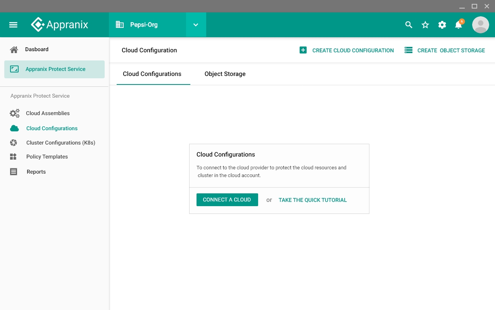
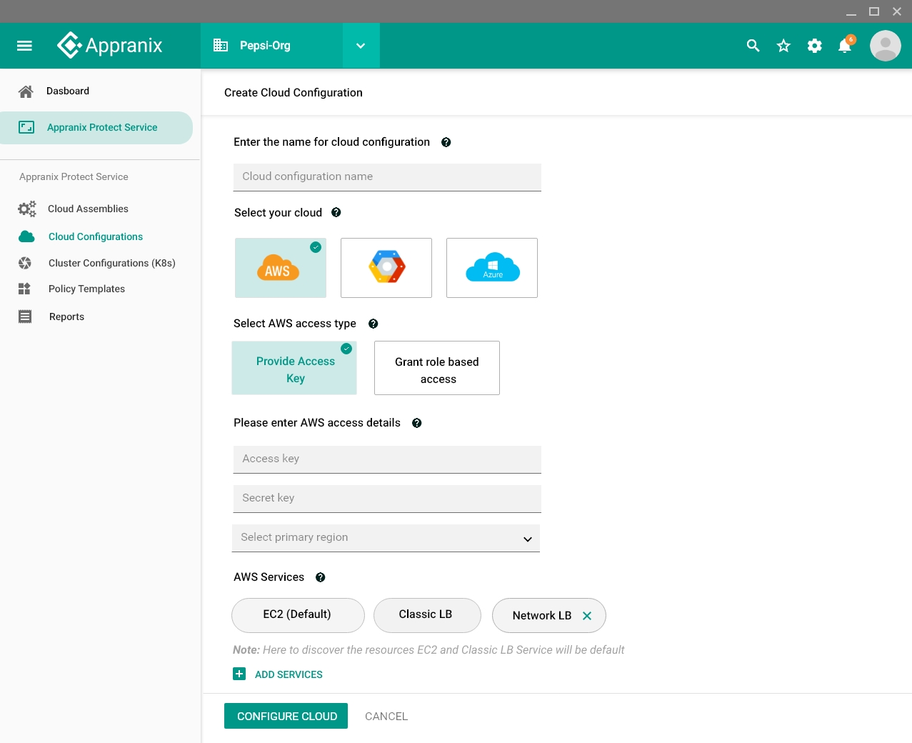
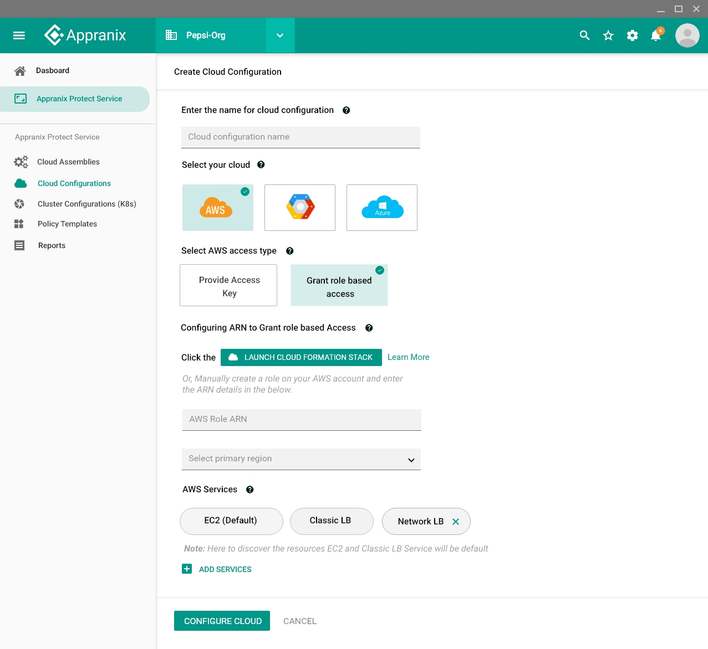
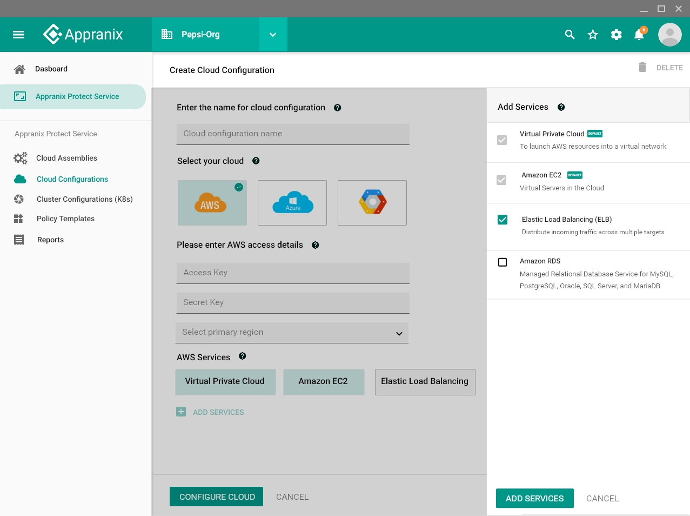
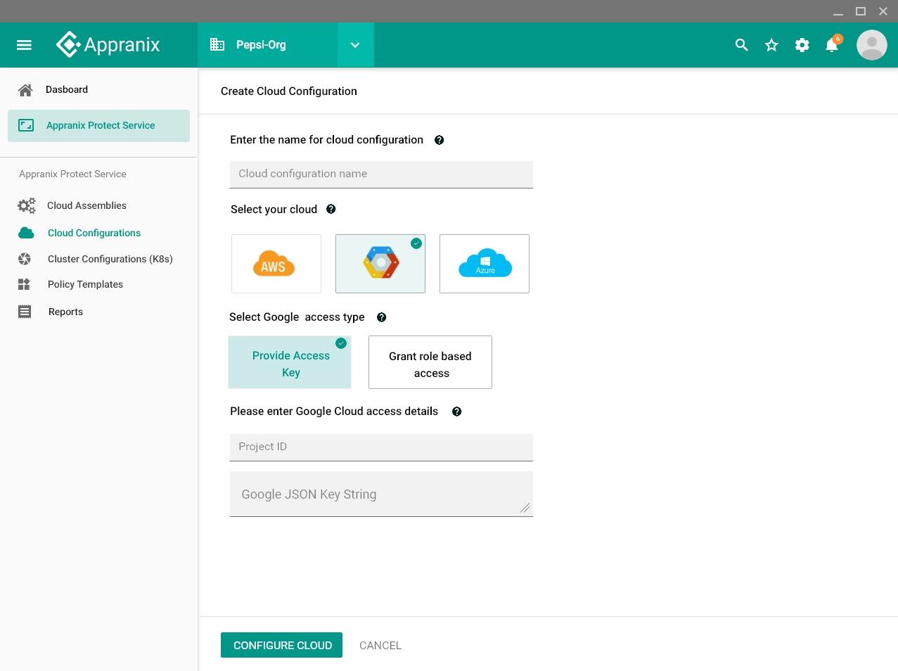
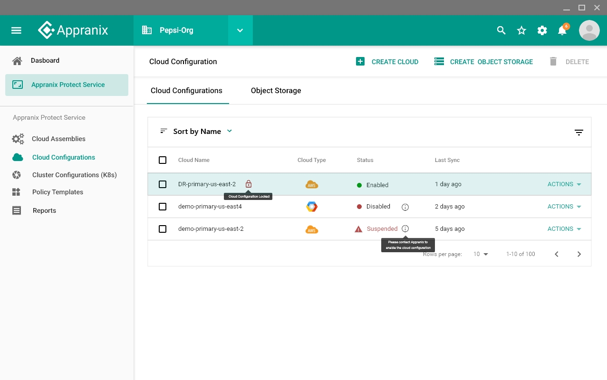
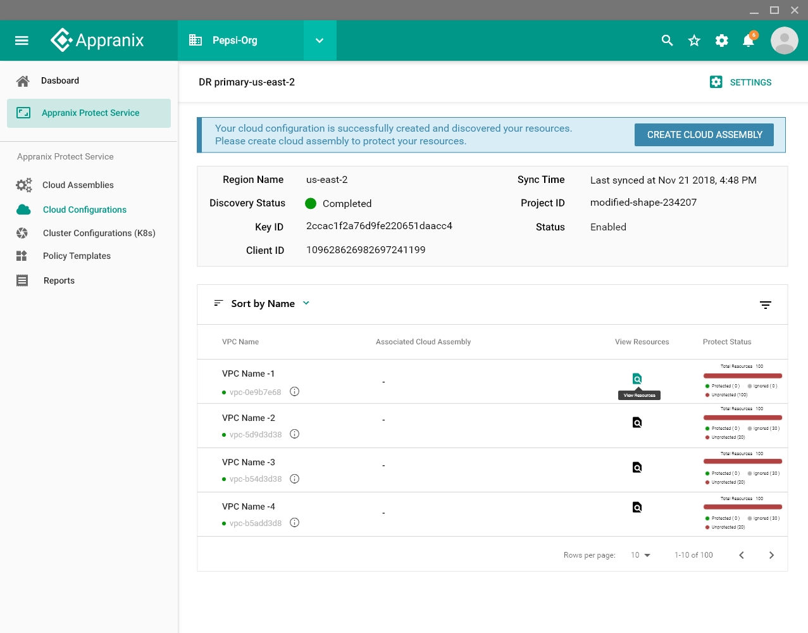
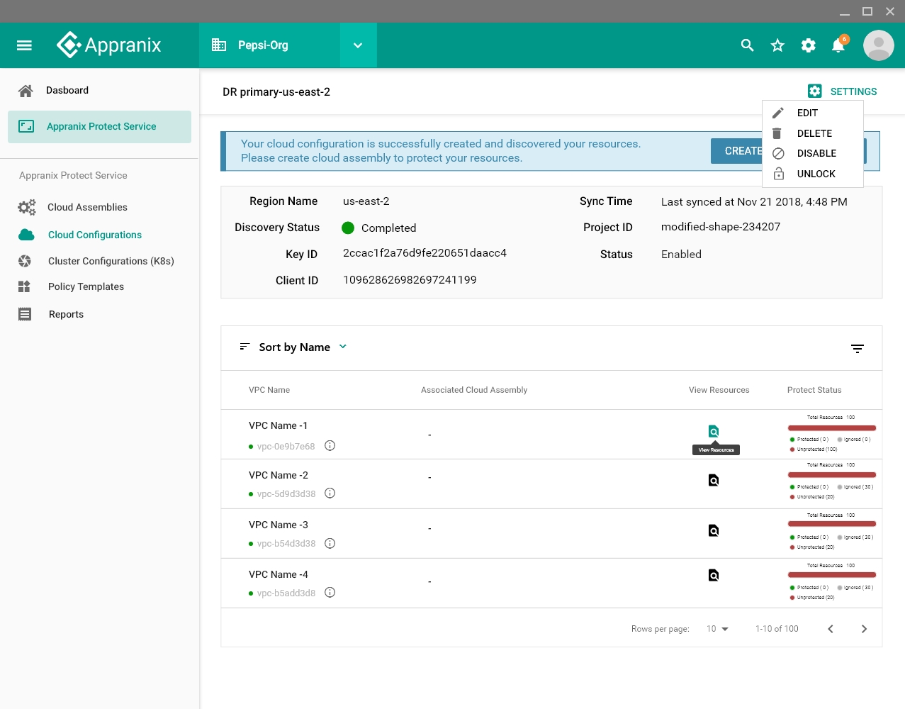

##Cloud Configuration

To create cloud configuration

1. Login to Appranix Application
2. Click **Cloud Configurations** in the side bar

Step-1: 
<figure class="concept_image">
  

 Figure 1 - cloud configuration 

</figure>						

Step-2: 
<figure class="concept_image">
  

 Figure 2 - cloud configuration 

</figure>

Step-3: 
<figure class="concept_image">
  

 Figure 3 - cloud configuration 

</figure>

Step-4: 
<figure class="concept_image">
  

 Figure 4 - cloud configuration 

</figure>

Step-5: 
<figure class="concept_image">
  

 Figure 5 - cloud configuration 

</figure>

Step-6: 
<figure class="concept_image">
  

 Figure 6 - cloud configuration 

</figure>

Step-7: 
<figure class="concept_image">
  

 Figure 7 - cloud configuration 

</figure>

Step-8: 
<figure class="concept_image">
  

 Figure 8 - cloud configuration 

</figure>
