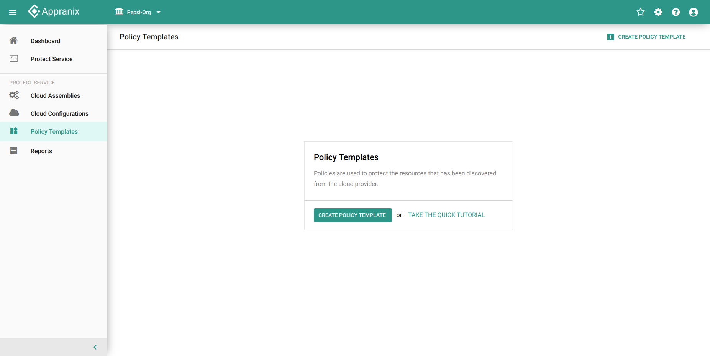
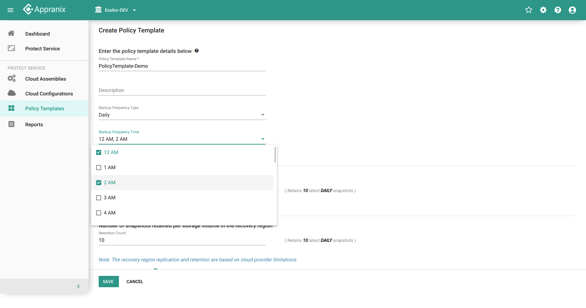

##Policy Template

###Policy
The policy will help you to implement a backup environment that is appropriate for your organization. Cloud storage is a remote backup solution. Data is a safe and much faster process in Disaster recovery.

**Policy Template**

A Predefined templeate provided by the product to protect the resources. (The Backup Frequency type can be Organization Hourly, Organization Weekly, Organization Monthly, Organization Yearly.
* Select the default policy template from the organization level and also have options to create a custom policy template.

To create policy template

1. Login to Appranix Application
2. Click **Policy Templates** in the left side navigation

   <figure class="concept_image">
   
   
 Figure 1 - Policy Template first page  

   </figure>

3. Click on **CREATE POLICY TEMPLATE**

   <figure class="concept_image">
   
   
 Figure 2 - Create Policy Template  

   </figure>

4. Name is a requird field, should not be empty, *(describe policy in description)*

   <figure class="concept_image">
   
   
 Figure 3 - Policy Template Name Validation

   </figure>

5. Select the **Backup Frequency Type** from the given drop down

   <figure class="concept_image">
   
   
 Figure 4 - Backup Frequency Type for Policy Template

   </figure>

   
#####Frequency Types
   
   Specify the options for the backup frequency type

* **Hourly**
   - Provides an hourly backup frequency type
   <!-- - Retention &  Replication Retention - Provide valid count for snapshots -->
<figure class="concept_image">
   
   
 Figure 5 - Houly Backup Frequency Type for Policy Template

</figure>

* **Daily**
   <!-- - Name - policy-template-daily -->
   - Provides the daily backup frequency type 
   - Multiple selections of times are applicable
   <!-- - Retention &  Replication Retention - Provide valid count for snapshots -->
<figure class="concept_image">
   
   
 Figure 6 - Daily Backup Frequency Type for Policy Template

</figure>

* **Weekly**
   <!-- - Name - policy-template-weekly -->
   - Provides the weekly backup frequency type
   - Multiple selections of days and times are applicable
   <!-- - Retention &  Replication Retention - Provide valid count for snapshots -->
<figure class="concept_image">
   
   
 Figure 7 - Weekly Frequency Type for Policy Template

</figure>

* **Monthly**
   <!-- - Name - policy-template-monthly -->
   - Provides the monthly backup frequency type
   - Multiple selections of dates and times are applicable
   <!-- - Retention &  Replication Retention - Provide valid count for snapshots -->
<figure class="concept_image">
   
   
 Figure 8 - Monthly Backup Frequency Type for Policy Template

</figure>

* **Yearly**
   <!-- - Name - policy-template-yearly -->
   - Provides the yearly backup frequency type
   - Multiple selections of month, date and time are applicable
   <!-- - Retention &  Replication Retention - Provide valid count for snapshots -->
<figure class="concept_image">
   
   
 Figure 9 - Yearly Backup Frequency Type for Policy Template

</figure>

**6. Allow Override**
   - Providing permission to override the policy in future

**List of all Policy Template details and to perform the action on it:**

<figure class="concept_image">
   
   
 Figure 10 - List of Policy Template

</figure>

**Action:-**
   - **Lock**
      - Policy template cannot add any new assemblies.
      - It will not be visible in cloud assembly.
   - **Unlock**
      - Unlocking will allow changes.

####Details of Policy template
<figure class="concept_image">
   
   
 Figure 11 - Details of Policy Template

</figure>

To delete policy template

* Click on the settings and select **Delete** option from the menu 

<figure class="concept_image">
   
   
 Figure 12 - Delete Policy Template

</figure>

 
