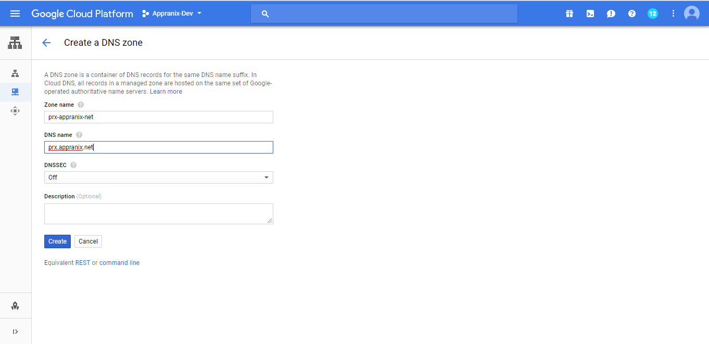
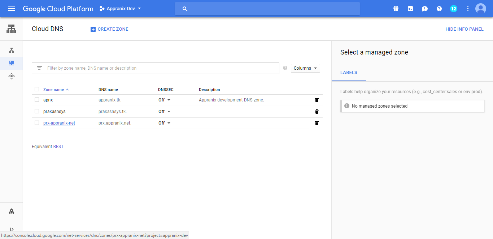
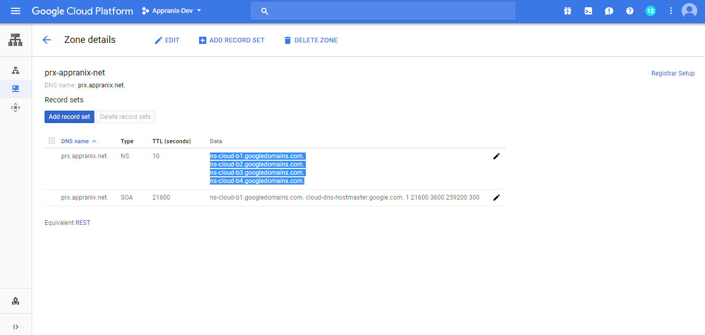
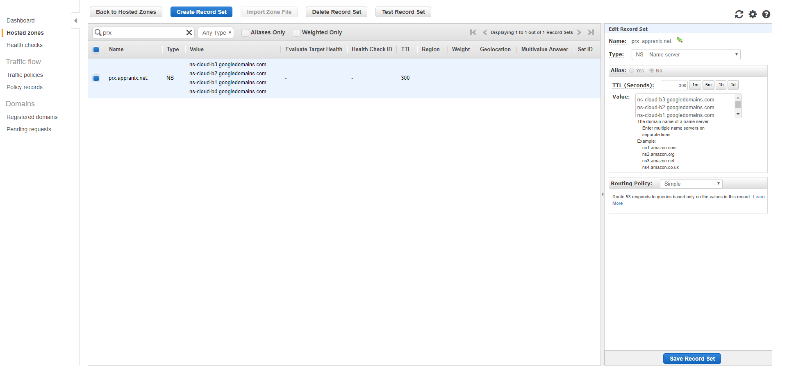
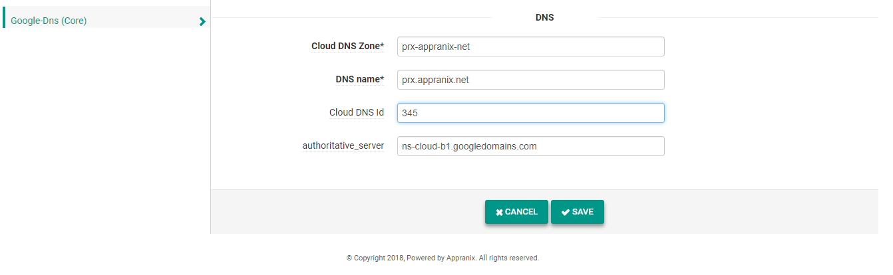

###Introduction:

In Appranix SaaS platform, Clients are able to add clouds and cloud related services to deploy applications in the cloud and manage applications easily without operation overhead and downtimes.
Appranix supports the following public clouds:

 1. GCP
 2. AWS
 3. Microsoft Azure

The following cloud services are supported by Appranix

  1. Compute
  2. Storage
  3. DNS
  4. Load Balancer

Adding the above services are a straightforward approach except DNS which requires prerequisites. Before going into the requirements of adding DNS service to Appranix, why we need a DNS service will be a question for cloud architects.

 If we add above services in appranix saas platform is a straightforward task but DNS service needs pre-requirement. Before go to  DNS service integration in appranix saas cloud, why appranix need DNS service, That is the  question raise for cloud architects.

###Problem:

If we deploy three tier apps in separate instances inside a cloud, the web tier instance, middle tier instance and the db tier instance should connect internally through instance ip or instance hostname to establish connection between tiers to accomplish user requests. In cloud, using instance ip to connect between tiers is not a good idea as instance ip is an ephemeral resource and if we change IP addresses of instances, we need to edit all the application configurations to update the changes. This results downtime for applications.

###Solution:

Appranix addresses this by adding server hostname in cloud DNS zone file and uses hostname to link all tiers thereby reduces downtime for the applications hosted in Appranix. To implement the solution Appranix requires fully qualified register domain or subdomain from the clients. Appranix consumes cloud provider DNS service to add/update/delete record in zone file.

###Implementation:

Below steps depicts how we add the subdomain prx.appranix.net and create separate dns zone for prx.appranix.net subdomain in GCP Cloud DNS service, also gets subdomain nameserver details and add it to appranix.net zone for prx.appranix.net subdomain.

###Step 1:
Login into GCP → select Project → select Cloud DNS → add zone file for subdomain prx.appranix.net

<figure class="concept_image">
  
</figure>

###Step 2:
Select created subdomain prx.appranix.net zone file from Cloud DNS.

<figure class="concept_image">
  
</figure>

###Step 3:
Copy nameserver details of created subdomain prx.appranix.net zone file from Cloud DNS.

<figure class="concept_image">
  
</figure>

###Step 4:
Add subdomain nameservers into main domain appranix.net zone and wait for 5 minutes, then use centralops.net & paste your subdomain prx.appranix.net and verify google nameserver is updated.

<figure class="concept_image">
  
</figure>

###Step 5:
Login into appranix saas platform, select Cloud → click Add service → choose DNS where clients provide choose their cloud and their details.

  Cloud dns zone name:    prx-appranix-net

  Domain name:         prx.appranix.net

  Cloud-id:            345 (Any Random number)

  Authoritative_server:    ns-cloud-b1.googledomains.com

<figure class="concept_image">
  
</figure>

**Note:**  Appranix need fully qualified register subdomain and authoritative nameserver from pragyasystem to add DNS service. Pragyasystems use GCE cloud DNS to add subdomain and get nameserver details  and login into register.com portal to create subdomain and register nameservers for that subdomain.
