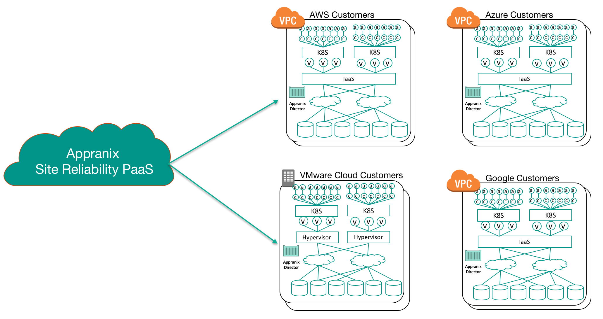
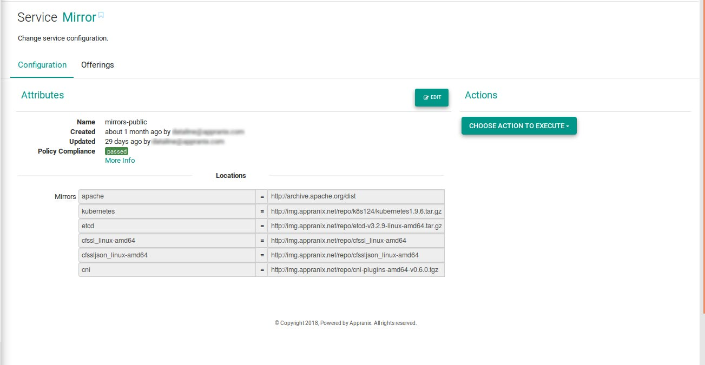

#Appranix Site Reliability Automation for Containers on Kubernetes


###1. Getting started with Appranix Site Reliability PaaS
Appranix Service can be quickly setup and configured with two different configuration paths.
You can deploy Kubernetes (K8s) based infrastructure on any supported cloud IaaS, such as AWS,
Azure, Google Cloud or VMware with customizations suitable for your network and storage.
Developers and testers within the business units can then start using the infrastructure by
deploying their containerized applications or services using Appranix Deliver service. Appranix
platform manages the underlying IaaS infrastructure for Kubernetes to provide the required high
reliability for container-based applications. Development organizations can flexibly connect their
CI/CD toolchains on top of the Kubernetes infrastructure for automating deployments. This
method allows for full customization of the Kubernetes infrastructure for each organization based
on your current infrastructure. Or, You can connect with already existing Kubernetes clusters and start managing for reliability
with Appranix’s platform.


<figure class="concept_image">
  
<p style="text-align: center;"> Figure 1 Getting Started with Appranix Managed Containers Service</p>
</figure>


###2. Flexible and Secure Multi-Cloud Deployment Model
Appranix is a Platform-as-a-Service management system that scales as the customer workloads
grow. Kubernetes cluster operations’ teams do not have to manually manage the growth. They also do not have to worry about backup and recovery of the management data associated with
management platforms. All the latest versions are delivered as when they are released.
As described in Figure 2. Cluster operations’ teams can manage multiple clusters consistently
across different clouds or different regions of the same cloud infrastructure. There are two
components to the Appranix Site Reliability Automation Service.


####2.1. Appranix Central Service Platform
This multi-tenant service is deployed on both AWS and Azure clouds to scale on-demand
with enterprise security. For example, Managed Service Providers or large enterprise
organizations can manage multiple customers’ tenancy along with any number of sub-accounts/organizations per business group without worrying about management
complexity. Appranix roles and controls can be assigned to different parts of the deployed
system based on the user privileges.


<figure class="concept_image">
  
  <p style="text-align: center;">Figure 2 Managed Service Provider Tenant Management</p>
</figure>


####2.2. Appranix Director
Appranix Director component gets installed within the customer VPC or Managed Service
Provider data centers. It is the Director that executes all the tasks to deliver, protect and
optimize the Kubernetes clusters. There can be multiple Director components per VPC or a
centralized one for a customer. It is very easy to install the Director directly from the Appranix
Service console.


####2.3. Requirements for Appranix Director Installation
Refer to the System Software requirements in Appendix 1.

<figure class="concept_image">
  
  <p style="text-align: center;">Figure 3 Appranix Platform Multi-cloud Deployment</p>
</figure>


###3. Configuring AWS Cloud for Appranix Director
Adding AWS details to Appranix PaaS is very simple. Login into the Appranix service with the
given account details for your organization and go to the cloud details page
https://app.appranix.net/web/ to add AWS cloud details.
The following minimal cloud IaaS services are required to deliver, protect and optimize
Kubernetes infrastructure using Appranix Site Reliability PaaS,
1. Compute
2. Storage
3. DNS
4. Load Balancer


####3.1. Appranix PaaS Platform and the Director
As part of the Site Reliability PaaS, Appranix deploys a Director component within the cloud
VPC.


<figure class="concept_image">
  
</figure>


####3.2. Deploying Appranix Director with Bastion Host
In this network architecture model, Director is deployed in a private subnet with a NAT
GATEWAY within a VPC. Appranix Director uses NAT GATEWAY to connect with Appranix PaaS
platform securely through https outbound. A Bastion host is required to deploy cloud
infrastructure in a private subnet with private IPs.

<figure class="concept_image">
  
</figure>


###4. Minimum Director Instance Requirements:
The Director instance running within customer VPC needs the following minimum infrastructure,
  1. OS - Centos/RHEL 7.x or 7.x with Docker package
  2. A virtual machine with
    1. 2 vCPU
    2. 8 GB memory
    3. 120 GB Storage


###5. Requirements for installing Kubernetes (K8s) on AWS
Appranix requires the following prerequisites to provision K8s cluster on AWS cloud platform.

1. AWS user account and password, API and SECRET KEY for that respective account with IAM
   roles and permissions as specified below.

   IAM roles Json Details:
```Json         
           {
         "Version": "2012-10-17",
         "Statement": [
           {
         "Sid": "VisualEditor0",
         "Effect": "Allow",
         "Action": "iam:CreateServiceLinkedRole",
         "Resource": "*",
         "Condition": {
         "StringEquals": {
         "iam:AWSServiceName": [
         "autoscaling.amazonaws.com",
         "ec2scheduled.amazonaws.com",
         "elasticloadbalancing.amazonaws.com",
                              ]
                        }
                     }
                 },
          {
         "Sid": "VisualEditor1",
         "Effect": "Allow",
         "Action": [
         "route53:*",
         "ec2:*",
         "elasticloadbalancing:*"
            ],
         "Resource": "*"
                 }
              ]
            }
```
2. AWS IaaS with the following details
  1. Region Name
  2. Zone Name
  3. VPC Name
  4. Subnet Name
  5. OS-Image: CENTOS-7.x (preferred) or RHEL-7.x
  6. Customer purchased instance sizes
3. Route-53 Private DNS zone for the automated provisioning and decommissioning of
   Kubernetes cluster node
4. AWS VPC configuration should have the following
  1. DNS resolution: yes
  2. DNS hostname: yes
  3. NAT GATEWAY should be enabled in the VPC
5. Mirrors-Public - Software downloads for Kubernetes

    During Kubernetes deployment, Kubernetes installer connects with the mirror service to download Kubernetes and other required Softwares/Binaries.

   <figure class="concept_image">
     
   <p style="text-align: center;"> Mirror Service for Kubernetes</p>
   </figure>


####5.1. Configuring Infrastructure Services for Kubernetes
Once AWS cloud details are added, you can configure individual infrastructure services such
as compute, storage, DNS etc. with “Add Services” as shown in Figure 4.


<figure class="concept_image">
  
<p style="text-align: center;"> Figure 4 AWS Services Configuration</p>
</figure>


####5.2. User Management
You can add administrators or any users with appropriate controls and access privileges
based on your organization requirements. More details for configuring users can be found here
- https://app.appranix.net/docs/user-guide/pages/tour/3.3-usermanagement.html


####5.3. Organization Management
Multiple organizations or sub-organizations can be created and managed within a tenant’s
account. More details can be found here
- https://app.appranix.net/docs/user-guide/pages/configurations/4.1-create-organization.html


###6. Enterprise Security with Appranix Director
  1. Appranix Director is configured within the client premises or within the VPC
  2. There are no inbound connections to the Director from Appranix PaaS
  3. There is only one outbound connection through 443 port, which is typically already open for all https connections
  4. Customer account logins can be further locked down by using federated Microsoft AD or
already available external SSO authentication
  5. Customer’s Appranix account can also be locked down to a VPN connection from a
laptop/device only with an internal AD authentication
  6. Further, customers can also whitelist IPs on the Appranix PaaS. This will allow only those
devices that have the permitted IPs to login to Appranix
  7. Clients SSH keys and application passwords stay with the Director, inside customer data center or the VPC and not shared with the Appranix PaaS platform
  8. By default, customer SSH keys and other credentials are configured with a Hashicorp Vault or any authorized Key Management Service/System in the Director control panel
