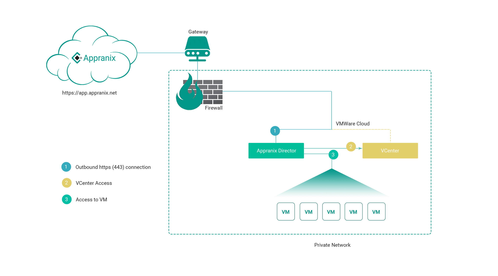

# Director Control Panel

# Installation

- [Hardware & Software Requirements](#hardware--software-requirements)
  - [VMware vCenter Access](#vmware-vcenter-access)
  - [VMware Template Requirements](#vmware-template-requirements)
    - [RHEL Image](#rhel-image)
    - [Windows Image](#windows-image)
  - [DNS Server Access](#dns-server-access)
- [External Internet Access](#external-internet-access)
- [Internal / Private DC Component Connectivity](#internal--private-dc-component-connectivity)

### Hardware & Software Requirements
The following hardware and software requirements are for the Appranix Director node, which will manage the private cloud deployments from Appranix platform. The Director node stays in the private network, reachable to the private cloud VMs.

1. OS - Centos/RHEL 7.2 or 7.3
2. Packages

  1. docker (Minimum 1.12.x, can be latest 17.0.x CE or EE)
  2. docker-compose - 1.14.0
3. Recommended hardware

  1. Memory - 4GB
  2. CPU - 2 core
  3. Storage - 20 GB (Root disk 10GB + Data disk 10GB)
  4. Network - access to internet (NAT or proxy).

#### VMware vCenter Access
Appranix Director connects the VMware vCenter to create new virtual machines, the following privileges are required for connectivity.

Appranix needs a user with privileges from “Resource Pool Administrator (sample)” with additional privileges to manage the “Guest Operations” in Virtual Machines, “Datastore”, “Network”, “vSphere Tagging”.

#### VMware Template Requirements

##### RHEL Image
1. Expected OS: RHEL 7.3
2. Image with VMWare tools
3. Prebaked with a sudo user with password or should have root access.

##### Windows Image
1. Expected OS: Windows 2012R2
2. Pre-installed with following tools / components

  1. Cygwin (With default packages)
  2. Additional cygwin packages

    1. openssl
    2. rsync
  3. VMware tools
3. Prebaked with an Administrator user

  1. The user can be Administrator or any other name
  2. The user should have Administrative privileges
  3. This user will be used to install components in the VM.

#### DNS Server Access

Appranix Director launches new VMs and maps the dynamic IP address to domain name using DNS service.
This works with various DNS providers, the simple solution is to work with DDNS
option on the existing DNS server. If the organizational DNS information is not provided,
Director will use the Director VM as a DNS server for the DDNS update.

The following steps helps to enable DDNS on a Windows server.

1. Launch the DNS Management Console (Run the command dnsmgmt.msc)
2. Create a new zone specific to Appranix (Isolate the instances and access rights)
3. Choose the zone type as “Primary zone”.
4. Provide a zone name. Eg: on.example.com or something similar.
5. Choose “Allow both nonsecure and secure dynamic updates” option.
6. Finish the wizard and test the configuration
  1. Use “nsupdate” command from a Linux node to verify the configuration.
  2. Once the record is updated ensure the updated DNS record is accessible in nslookup and ping to ensure the configurations are correct.

### External Internet Access
The below communications are initiated from the Director VM to download updates and receive deployment information from Appranix Platform. All the connections will use either NAT or HTTP proxy as available in the operating system, default proxy config.

Appranix will not initiate any inbound communication as it is not required.

### Internal / Private DC Component Connectivity

1. Director VM should be able to reach the VMWare VCenter for API connectivity
2. The VMs created from Nutanix/VMware through Appranix, should be reachable to perform further automation.

<figure class="concept_image">
  
</figure>
