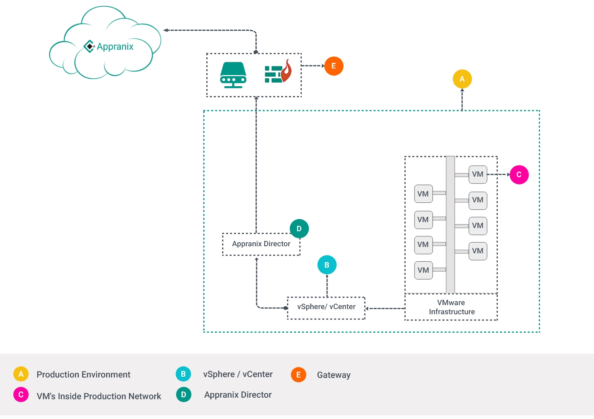

###Appranix Director Set-Up Instructions & Procedures for Communication:

<figure class="concept_image">
  
</figure>

1. Appranix Director(hereafter referred to as Director) should be provisioned in a VM that should be reachable to vSphere vCenter and the production VMs.

2. Director contains automation scripts and acts as a Jump Box for Appranix Platform(hereafter referred to as SaaS).

3. Director should not be exposed directly to the public internet via DMZ.

4. Director exposes its management web interface on port 443(HTTPS). This port is allotted only for the internal customer management purpose and it will never be accessed by the SaaS.

5. Production Automation Administrators(hereafter referred to as the User) should establish connections from the Director to the SaaS.

6. SaaS provides two endpoints for accepting connections from the Director,
  1. public shared endpoint - HTTP(S) proxy
  2. dedicated private endpoint - VPN gateway

###Outbound connections from Director:

| Endpoints       | Protocol          | Purpose |
|:-------------|:-------------|:-----|
|app.appranix.net | HTTPS | Establish connectivity to the platform, identifies the organization and cloud. |
|hub.appranix.net | HTTPS | Source for latest director images and other supported service docker images. |
|dl.appranix.net | HTTPS | Appranix deployment logs collector, collects the logs of automation script executions.|
|dq.appranix.net | HTTPS | Message queue endpoint to receive jobs and respond success/failure results messages.|

###How Director Works?

1. User initiates a connection to SaaS via Director management web interface.

2. Director makes an outbound HTTPS connection to app.appranix.net, once the connection is validated, a persistent outbound connection is established with dq.appranix.net over HTTPS.

3. The dq.appranix.net acts a message queue to deliver jobs to the Director from SaaS. The Director responds back to the SaaS on success/failure of a job through the dq.appranix.net.

4. The Director establishes outbound connections to various service providers(vsphere, aws, azure, netscaler, dns server, etc) based on the automation scripts.

5. The Director periodically connects to the Appranix update server to get the latest releases(metadata) and updates for both the Director and the automation scripts.

6. The Director's latest versions are downloaded from hub.appranix.net/tools.appranix.net.

7. The logs generated by the automation scripts in the Director will be sent to dl.appranix.net over HTTPS.

8. The Director's internal logs will be maintained in the VM and will not be sent to the SaaS.

###Director VM Hardware & Software Requirements:

1. OS - RHEL-7.x
2. Packages
  1. docker (Minimum 1.12.x, can be latest 17.0.x CE or EE)
  2. docker-compose - ( Minimum Version-1.14.0 and above)
3. Recommended hardware
  1. Memory - 4GB
  2. CPU - 2 core
  3. Storage - 50 GB (Root disk 30GB + Data disk 20GB)
  4. Network - Outbound connection to reach Appranix  platform(Public) through GateWay or Proxy (socks/https-proxy)on port 443(https). - For more details check Director communication architecture.
