# APPRANIX DIRECTOR INSTALLATION GUIDE FOR VMWARE

This Project helps in Automating Director Installation.

## Steps to be performed to automate Director Installation

1. Download the OVA file from the link [OVA File](https://www.dropbox.com/s/8z5r7tw0j2ef91w/Appranix_Director.ova?dl=0).

2. Log in to vSphere web client.

3. Click on **Hosts** & **Clusters**.

4. Right Click on vCenter Server & choose to **Deploy OVF Template**.
<figure class="concept_image">
  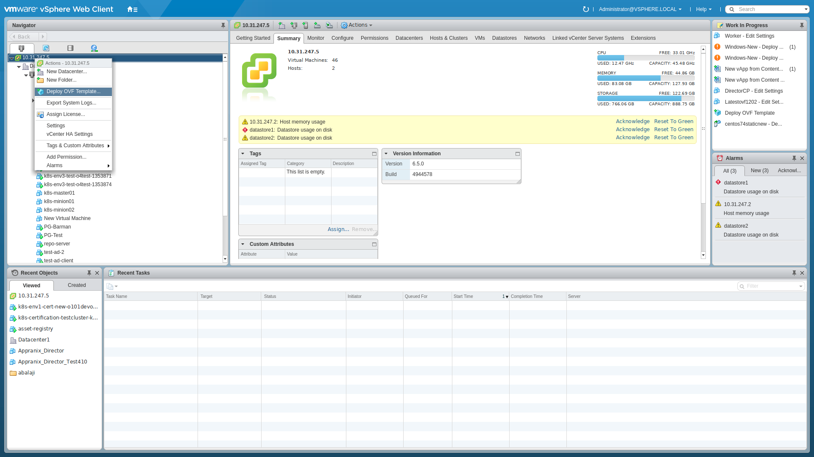
</figure>

5. On Deploy OVF wizard **Select Template** page, select the Local file option and click on the Browse button.
<figure class="concept_image">
  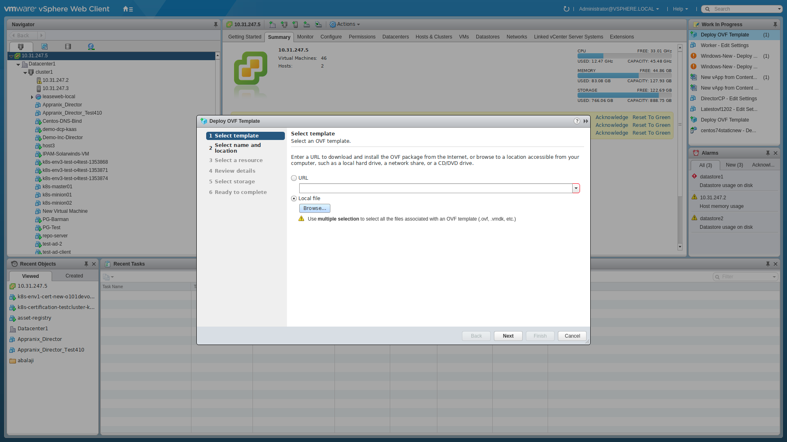
</figure>

6. Specify the location where Appranix_Director.ova template is downloaded and **click Next**.

7. On the **Select a name and folder** page, enter a unique name for the virtual machine or vAPP, select a deployment location, and **click Next**.
<figure class="concept_image">
  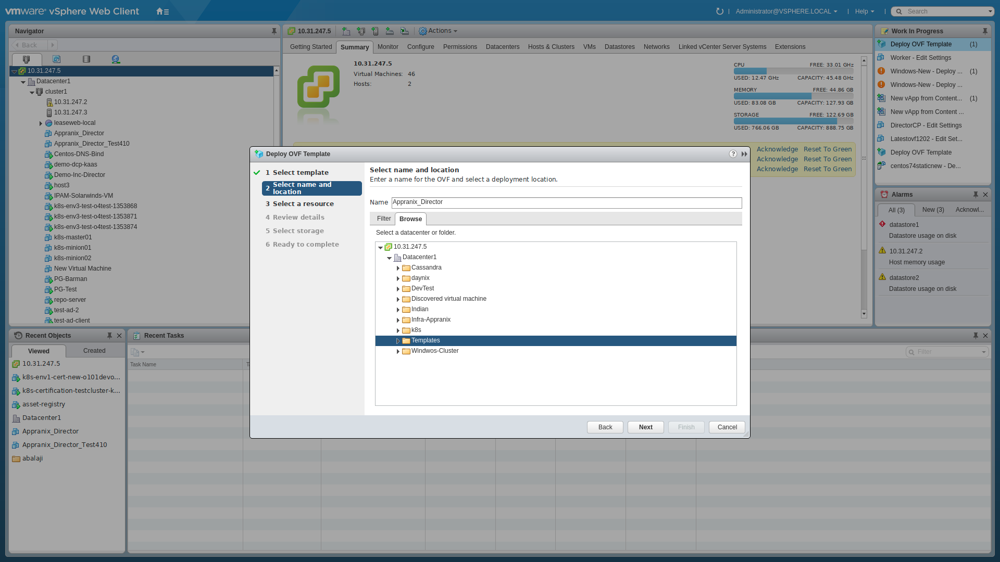
</figure>

8. On the **Select a resource** page, select the host or a cluster where you need to run the virtual machine or vAPP and **click next**.
<figure class="concept_image">
  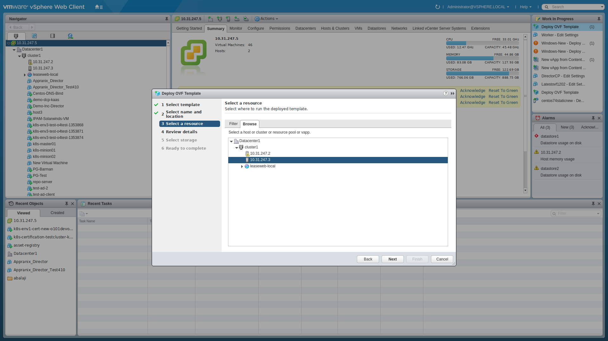
</figure>

9. On the **Review details** page, verify the OVA template details and **click Next**.
<figure class="concept_image">
  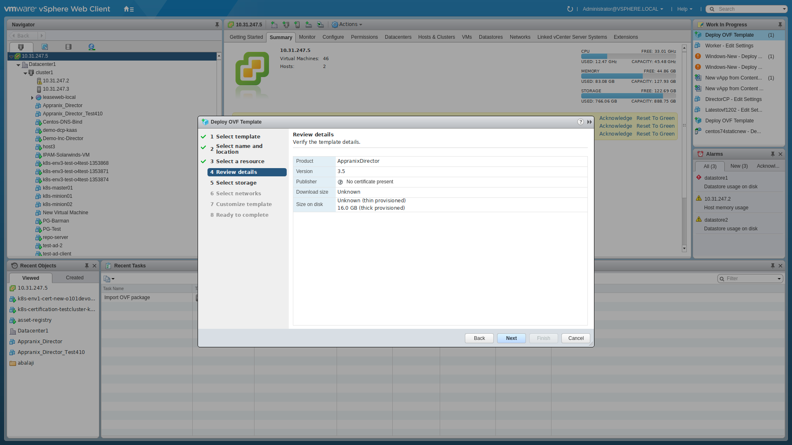
</figure>

10. On the **Select storage** page, define where to store the files for the deployed OVA template.
<figure class="concept_image">
  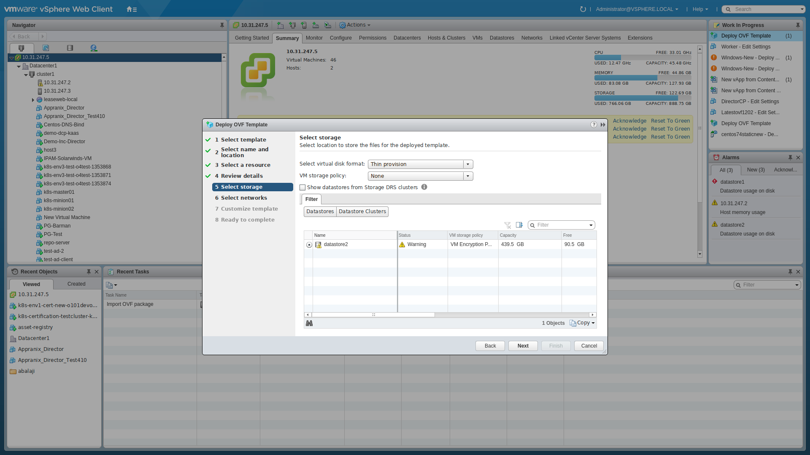
</figure>

11. On the **Select Network** page, select a source network and map it to a destination network **Click Next**.
<figure class="concept_image">
  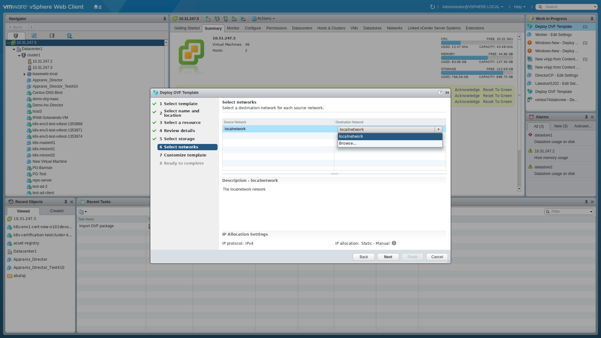
</figure>

12. On the **Customize Template** page, enter the following details:

  i) **Appranix Account**

  **API Token**: Copy the API Token from profile page in authentication section [Appranix](https://app.appranix.net/).

  <figure class="concept_image">
    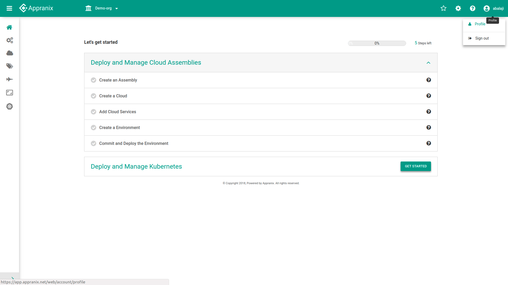
  </figure>
   
   
  <figure class="concept_image">
    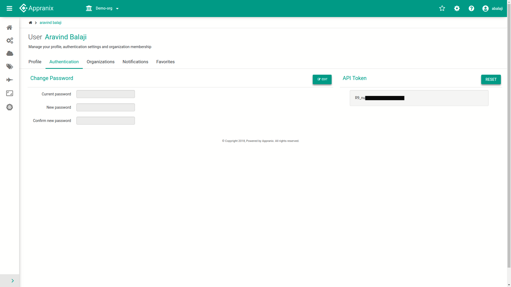
  </figure>

  ii) **Appranix Docker Registry**

    1.  **Username**: demouser

    2. **Password**: xxxxxx

    3. **Email**:  Enter a valid email id.

  iii) **Director Control panel**

  Enter a username and password to set up the Director control panel.
  Network

  1. **IP**: Enter an IP that you want to assign to the virtual machine or vAPP.

  2. **Netmask**: Enter a netmask that you want to allocate to the virtual machine or vAPP.(Valid values are 8,16,24,32)

  3. **Hostname**: Enter a hostname that you want to assign to the virtual machine or vAPP.

  4. **DNS**: Enter the primary and secondary  DNS that you want to assign to the virtual machine or vAPP.

  5. **Gateway**: Enter a valid gateway.

  6. **Proxy Authentication Required**

  **Setup proxy**: Enter 'Y'(Yes) if you need proxy configuration or else type 'N'(No).
  Enter a host and proxy if needed or else skip it and **Click Next**.
  <figure class="concept_image">
    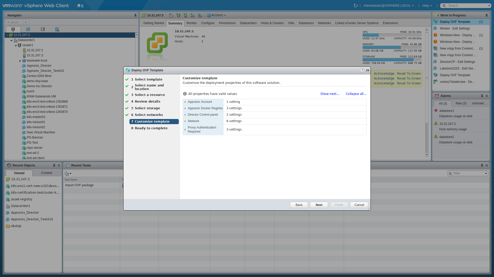
  </figure>

13. On the **Ready to complete** page, review the configuration and click Finish.
<figure class="concept_image">
  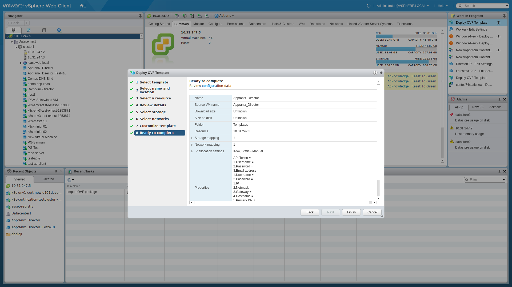
</figure>

14. After successful deployment , power on the machine and login.

15. Copy the data of the file **/root/appranix-data/ssl/root-ca.pem** and create a file named as **root-ca.pem** in your local machine and paste the copied data into it.

16. Import the root-ca.pem file in your browser into the certificate section and restart the browser.

17. Enter the URL stated in the certificate along with **https://** in the browser where the certificate was added.
