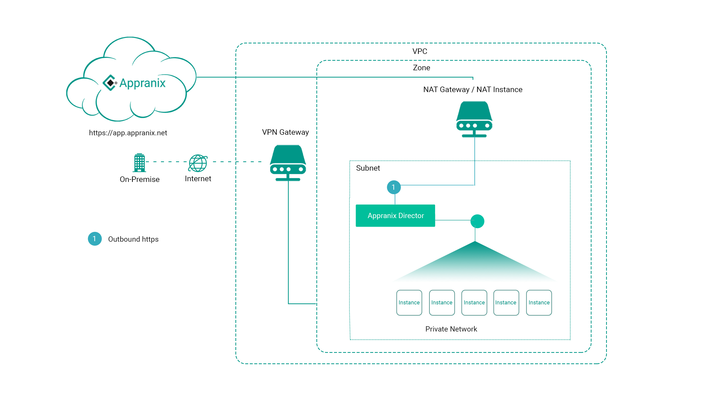

#Appranix PaaS and Director Requirements

The following minimal cloud services are required to deliver, protect and optimize Kubernetes infrastructure using Appranix Site Reliability PaaS,

1. Compute
2. Storage
3. DNS
4. Load Balancer


###Appranix PaaS Platform and the Director:

As part of the Site Reliability PaaS, Appranix deploys a **Director** component within the cloud VPC to manage Site Reliability Engineering automation.


<figure class="concept_image">
  
</figure>


###Security with Appranix Director:


1. Appranix Director stays within the client premises or within the VPC.
2. There are no inbound connections to the Director from Appranix PaaS
3. There is only one outbound connection through 443 port, which is typically already open for all https connections.
4. Customer account logins can be further locked down by using federated Microsoft AD or already available external SSO authentication.
5. Customer’s Appranix account can also be locked down to a VPN connection from a laptop/device only with an internal AD authentication.
6. Further, customers can also whitelist IPs on the Appranix PaaS. This will allow only those devices that have the permitted IPs to login to Appranix.
7. Clients SSH keys and application passwords stays with the Director only inside customer data center or the VPC and not shared with Appranix PaaS platform.
8. By default, customer SSH keys and other credentials are configured with a Hashicorp Vault or any authorized Key Management Service/System in the Director.


###Appranix Director Deployment Architecture Models:


There are typically three network architecture models that all cloud providers support globally. Appranix supports all three network architecture models for the Director deployment.

1. Bastion host architecture
2. VPN network architecture
3. Public-IP network architecture


###Bastion Host Deployment Architecture Model:

In this network architecture model, Director is deployed in a private subnet with a NAT GATEWAY within a VPC. Appranix Director uses NAT GATEWAY to connect with Appranix PaaS platform securely through https outbound. A Bastion host is required to deploy cloud infrastructure in a private subnet with private IPs.


<figure class="concept_image">
  
</figure>


###VPN Network Deployment Architecture Model:

In this network architecture model, Appranix PaaS connects to a client VPN and deploys the Director in a private subnet. Director also requires a NAT GATEWAY enabled for the customer VPC. Appranix Director uses NAT-GATEWAY to connect with Appranix PaaS platform securely through https outbound.

Below diagram explain how this model works and connects to the Appranix PaaS platform


<figure class="concept_image">
  
</figure>


###Public-IP Deployment Architecture Model for Pilots and Proof of Concepts:

In this deployment architecture model, Appranix deploys the Director in a public subnet. The Director connects Appranix PaaS platform securely through https outbound. In this model Director can create instances with public and private IPs. SSH connections and communication with Appranix PaaS go through the public IP only, no private IPs are required.

Below diagram explains how this model work and how it connects to Appranix SaaS platform


<figure class="concept_image">
  
</figure>


###Minimum Director Instance Requirements:
Minimum virtual machine requirements for the Director instance running within customer VPC or data center are,

  1. OS - Centos/RHEL 7.x or 7.x
  2. Packages - Docker
  3. Recommended virtual machine configuration
        3.  vCPU
        3. 8 GB memory
        3. 120 GB Storage
        3. d.1Gbps network throughput


###Required Customer Credentials to Configure Director on Appranix PaaS:

  1. Appranix account ID.
  2. Appranix organization name.
  3. Appranix cloud name/region as provided in the organization.
  4. Authorization key provided during Appranix cloud creation step.

###Requirements for installing Kubernetes (K8s) on AWS

Appranix requires the following prerequisites to provision K8s cluster on AWS cloud platform.

  1. AWS user account and password, API and SECRET KEY for that respective account with IAM roles and permissions as specified below.

  IAM roles Json Details:

   ```json
        {
        "Version": "2012-10-17",
        "Statement": [
          {
          "Sid": "VisualEditor0",
          "Effect": "Allow",
          "Action": "iam:CreateServiceLinkedRole",
          "Resource": "*",
          "Condition": {
            "StringEquals": {
                "iam:AWSServiceName": [
                    "autoscaling.amazonaws.com",
                    "ec2scheduled.amazonaws.com",
                    "elasticloadbalancing.amazonaws.com",
                ]
             }
          }
       },
     {
         "Sid": "VisualEditor1",
         "Effect": "Allow",
         "Action": [
             "route53:*",
             "ec2:*",
             "elasticloadbalancing:*"
            ],
           "Resource": "*"
         }
        ]
      }
     ```

  2. Appranix recommends Bastion host deployment architecture model explained above for the AWS cloud with the following details
    2. Region Name
    2. Zone Name
    2. VPC Name
    2. Subnet Name
    2. OS-Image: CENTOS-7.x (preferred) or RHEL-7.x
    2. Customer purchased instance sizes

  3. Route-53 Private DNS zone for the automated provisioning and decommissioning of Kubernetes cluster nodes

  4. AWS VPC configuration should have the following
    4. DNS resolution: yes
    4. DNS hostname: yes
    4. NAT GATEWAY should be enabled in the VPC
