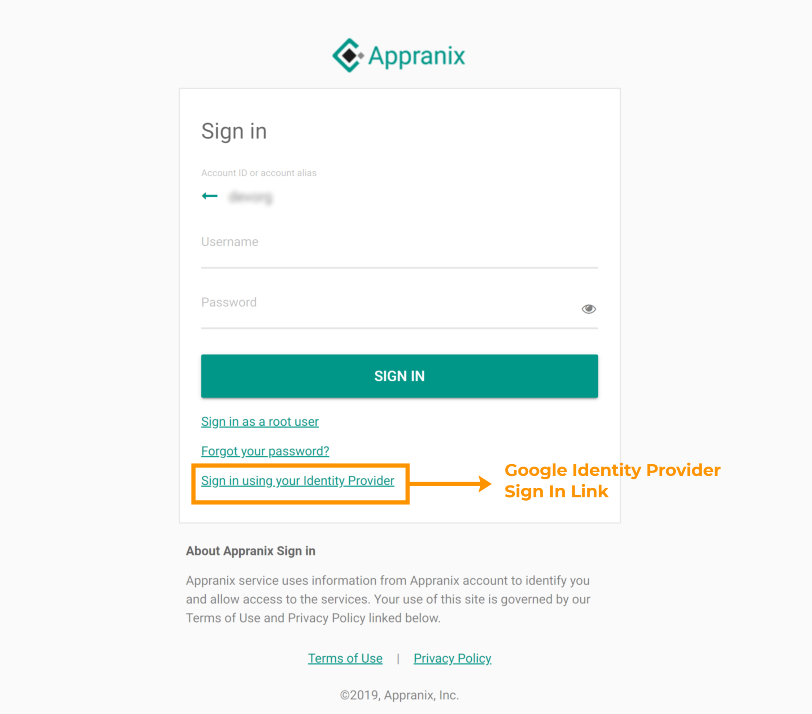
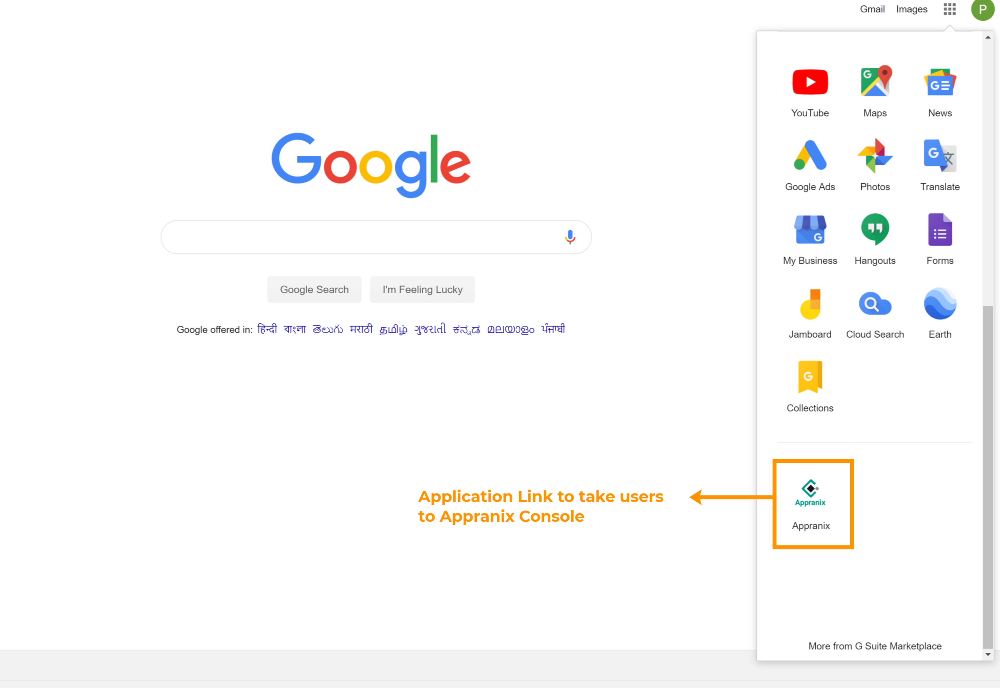

# Sign In with Google Credentials

**Option:1**  Appranix account admin configured Google G Suite as a SAML Identity Provider for Appranix, account users will see a new link “Sign in using your Identity Provider” in the account login page. Your account login page should be like “https://{Replace your account name}.signin.appranix.com”

<figure class="concept_image">
  

 Figure 1 - Sign In with Google Credentials 

</figure>

**Option:2**  Users can able to login from their Google apps tray.

<figure class="concept_image">
  

 Figure 2 - Sign In Link On Google Apps 

</figure>

