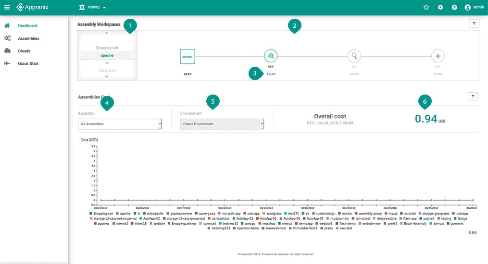

# Dashboard

<figure class="concept_image">
  
</figure>

##### Key Points

1. List of Assemblies available within the Organization.
2. The delivery chain of the Assembly, the groups and their Environments overall status.
3. Cost of each Environment group, click on them to see the breakup.
4. selecting the Assembly to see the cost.
5. Cost for individual Environments, represented for the Organization.
6. The overall cost for the current month.
