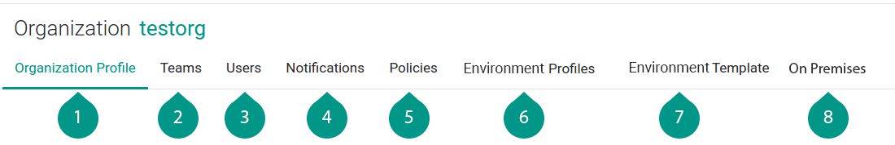

# Organization Profile & Access Privileges

Organization wide settings, which include user and access privileges and enforcement policies and profiles. Configurations applied here will impact the entire organization.

<figure class="concept_image">
  
</figure>

##### Key Points

##### 1. Organization profile
  - The organization owner and generic profile settings.

##### 2. Teams
  - A way to manage user access by allowing or restricting accesses and permissions.
  - Team is the way to manage access control for the users.

##### 3. Users
  - An individual registered user. It can be user or an application
  - When the user is added to the system, the user can be granted access to one or more [organizations](../2-concept.md#organization) by adding the user to an existing group or team.

##### 4. Notifications
  - You can enable notifications for your Appranix account to give you a heads up when a change is made in design,
deployments, monitoring threshold violation, scale and repair actions. There are common notifications even without enabling here, while this feature helps you to integrate with your existing systems like ticket tracking, chat and tools.

##### 5. Policies
  - Policies help you to define various conditions that has to be met for an approved application in design or during deployment.
  - It can be active or passive in enforcement, this helps you to stop on the fly or alert you to act on it later.

##### 6. Environment Profile
  - Environment Profile, helps to restrict and template the Environment creation steps, enforcing teams to follow selective standard deployments.

##### 7. Environment Groups Template
  - The Environment Groups Template is used to structure the application delivery chain grouping (Eg: dev, qa, prod) for the organization, which will be applied on every new assembly created.

##### 8. On Premises
  - Provides installation options and procedures to enable “On Premises” cloud deployments using Appranix.
