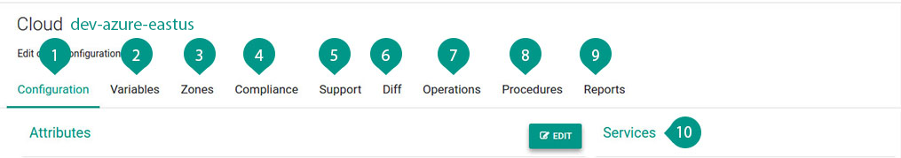

#Clouds

A cloud can be defined as a group of services which enables resource allocation/usage.

<figure class="concept_image">
  
</figure>

##### Key Points

1. Configuration, provides the control to disable any operation on the cloud or make it offline gracefully. Teams can be added, which requires specific access to the cloud.
2. Variables are custom values that you need during your application deployment, available only in this cloud.
3. Zones, helps to mark resources running various zones in a single cloud.
4. Compliance, provides additional security option by providing an option to filter and execute your security compliance scripts and tools during deployment in the specific cloud.
5. Support, to provide deployment approval
6. Diff, shows the difference from the default values
7. Operations, will list the Environments that are deployed in the cloud, which requires some action in its components
8. Procedures helps to execute maintenance scripts for the cloud
9. Reports,  to view a report of instances that are consumed by your assembly for all your Environments in the cloud.
10. Services, that are needed to deploy an Environment are added eg: DNS, Compute
