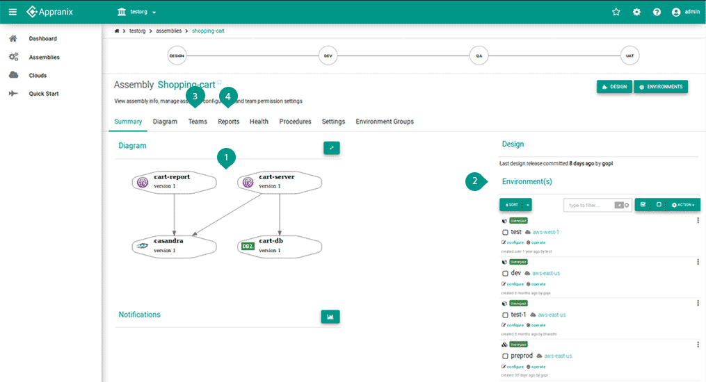

# Assembly

Assembly is an area where you can manage the delivery of your services supported by common application and infrastructure.

<figure class="concept_image">
  
</figure>

To create an assembly, use the assemblies link in the navbar and by clicking on add new button.
For Eg. Here we have created a name assembly called shopping cart by giving the details for that assembly.

##### Key Points

##### 1. Design Phase
   Design is an area within an assembly where the application architecture is described. This design can be created by using two different types
  - Design Catalog (Catalog are used at add assembly. where user can select the design from the catalog to bootstrap their assembly with popular design blueprints).
  - Manually by adding [platform](../2-concept.md#platforms). (Here platforms is nothing but a prepackaged software template that can be installed from packs.)

##### 2. Environments
   An [Environment](../2-concept.md#environment) is a combination of your assembly(base design) with operational attributes to match the associated business requirement, such as new dev,qa,prod Environments.  Changes from the base design can be pulled on demand.
##### 3. Teams
   If you are admin for the [organization](../2-concept.md#organization) you can easily add teams to an assembly.

##### 4. Assembly Report
   To view a report of instances that are consumed by your assembly for all of your Environments.

   Reports can:
  - Show the overall reports of the Environment.
  - Be generated on assembly or cloud basis. In each, we can get reports on the core memory and instance basis. Be viewed as a graph or in tabular form.

   There are three types of reports:
  - Core: Overall report of the core used
  - Memory: Overall report of the memory used
  - Instance: Overall report of instances used

<!-- ##### 5. Breadcrum Chain
  To navigate through the Design Phase and the Environment Groups within the Assembly. -->
