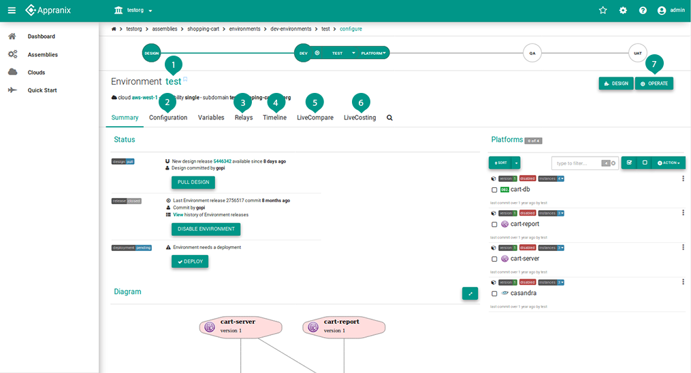

# Environment

An Environment is a combination of your assembly (base design) with operational attributes to match the associated business requirements, such as a new dev, qa, or prod Environments.

<figure class="concept_image">
  
</figure>

##### Key Points

1. Environment name that is unique to the Assembly

2. **Configuration** section is used to configure the Environment with an option to edit the Environment.

3. A **notification relay** allows notification filtering and routing configuration for a given Environment. All notification for a given Environment will be matched against existing Environment relays for filtering based on source, severity, subject/text and ns path to specified list destination addresses.

 There is a default relay available to all Environments, which route alerts to assembly owner. Users have the privilege to delete default relay.

4.  We can see the release history **timeline** which deployment are in effect and which are still open. The release activities can be
    - Closed: Displays the releases deployed on the Environment
    - Open: Displays the open releases
    - Cancelled: Deployment is cancelled inbetween

5. Change Management made easier with **LiveCompare**. Comparing two running Environments side by side to see how your production system is affected by upcoming changes from development or test or pre-prod Environments.

6. Optimize your cloud spend by knowing your entire application cost “live” across multiple Environments separated by applications in different cloud accounts using **LiveCosting**.

7. Clicking this will toggle between configure and operate mode.
