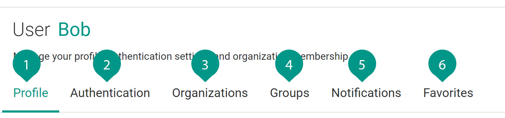

# User Profile

<figure class="concept_image">
  
</figure>

##### Key Points

1. Profile of the user, Settings to edit mail id and name
2. Authentication, to authenticate a user with API token and to change the password
3. Organizations, list the organizations that can be accessible by the user
4. Groups, to group the users
5. Notifications, watching these assemblies and Environments by receiving email notifications about deployment and operation events.
6. Favorites, to view all favorites of the user across all organizations.
